## 示例程序
examples 目录中包含了一些示例程序，你可以参考这些示例程序来完善你的应用程序。

## 1. examples/basic
一个基础的窗口示例程序，带有最小化、最大化、还原和关闭按钮。    
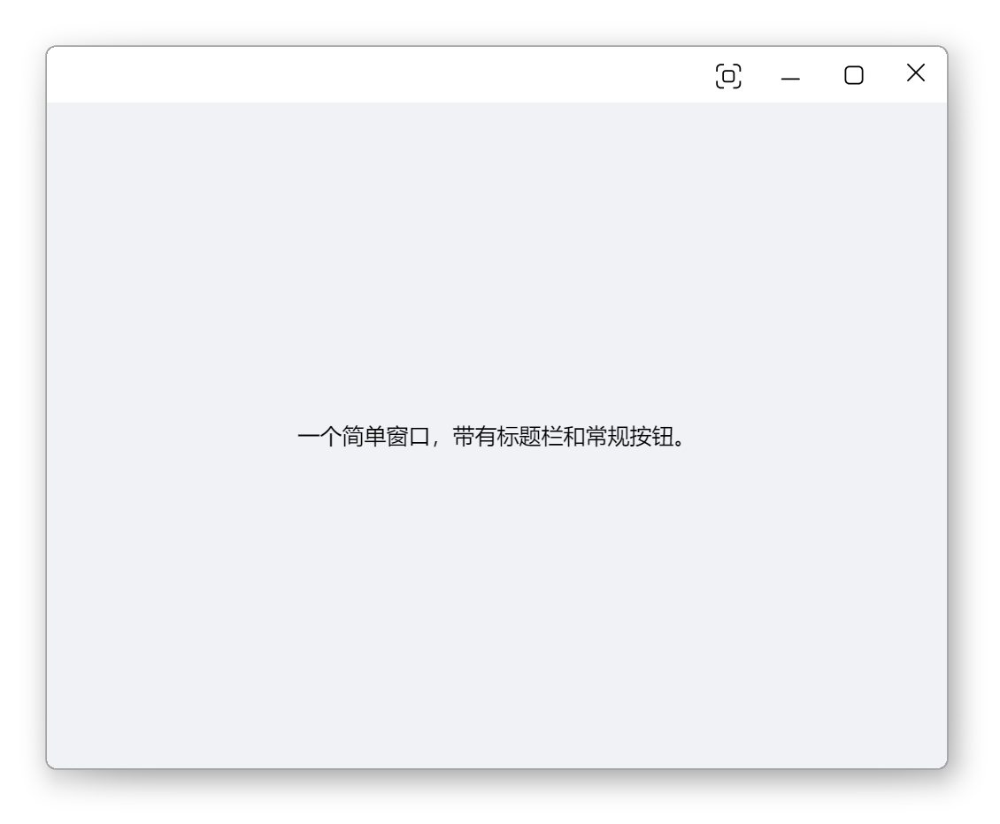

## 2. examples/cef
演示如何在 nim_duilib 中使用 CEF 控件，包含 C++ 与 JavaScript 交互。    
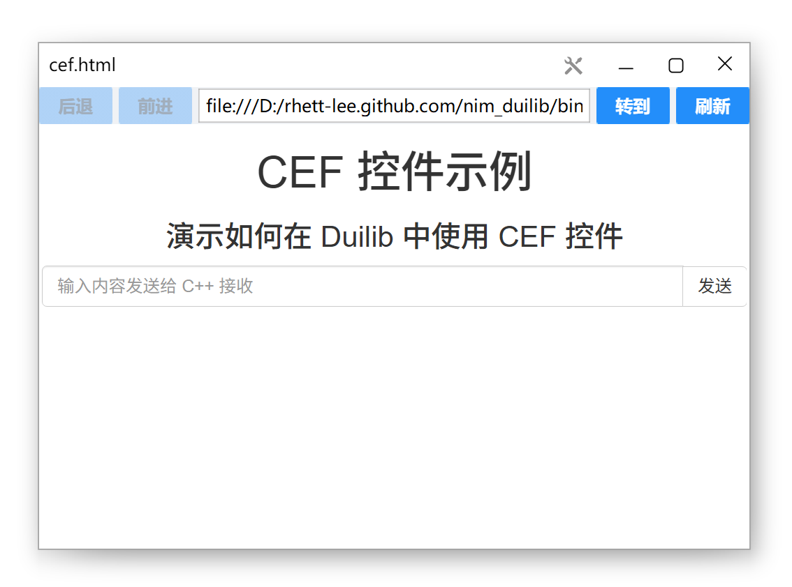

## 3. examples/ColorPicker
演示如何使用拾色器控件的程序。
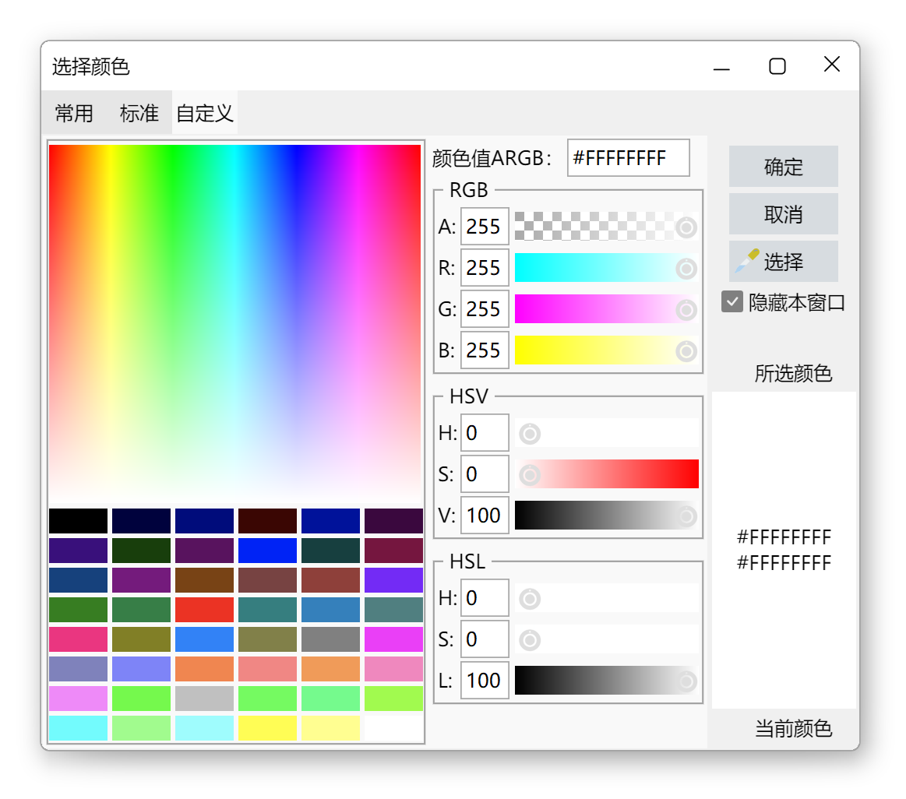

## 4. examples/controls
一些常用控件的样式使用方法示例。    

## 5. examples/layouts
包含一个登录窗口和一个模拟微信 PC 聊天布局的窗口示例。    
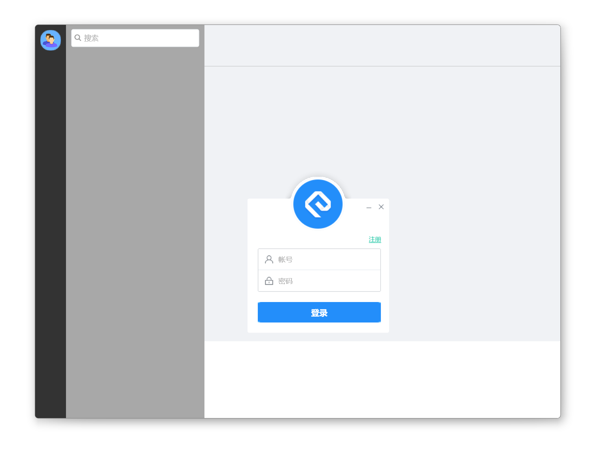

## 6. examples/ListBox
演示如何使用ListBox容器的程序。
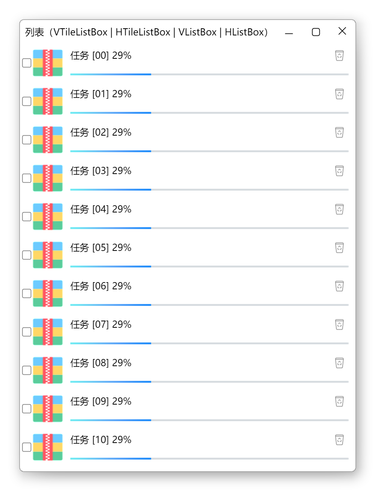
    
## 7. examples/ListCtrl
演示如何使用ListCtrl控件。    
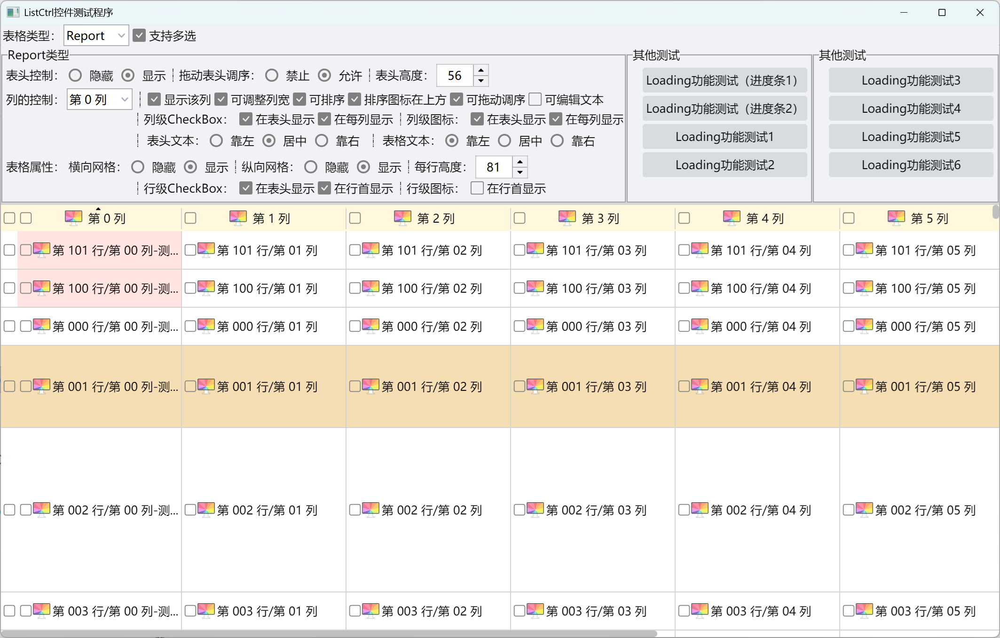

## 8. examples/move_control
演示如何使用Box容器的"drag_out_id"和"drop_in_id"属性来实现控件在不同容器之间的移动效果。    

    
## 9. examples/multi_browser
基于 CEF 的自定义多标签可拖曳浏览器示例。
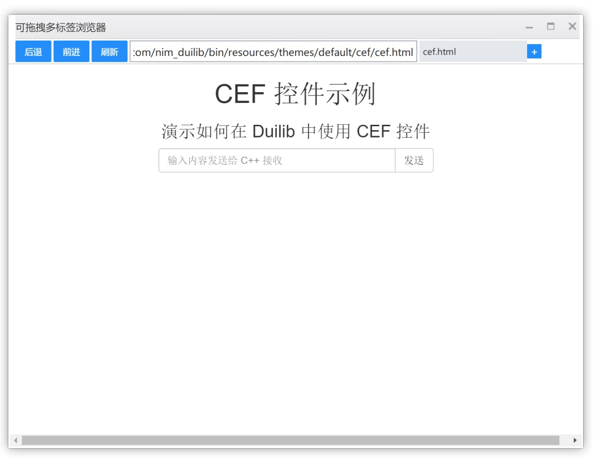
    
## 10. examples/render
演示如何使用渲染引擎的程序，同时也包含了各种控件/容器的使用示例。    
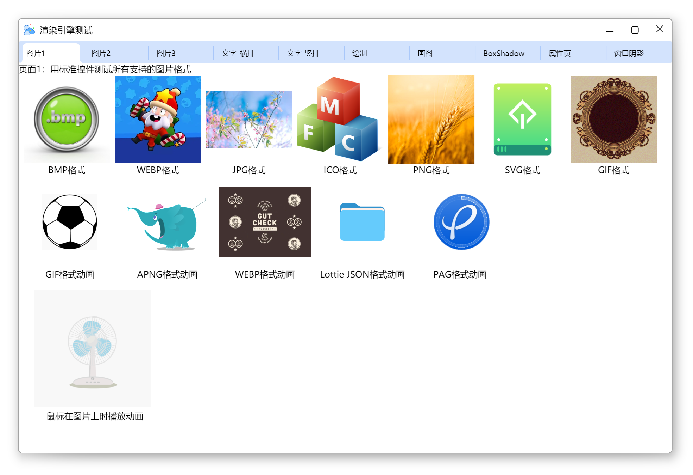
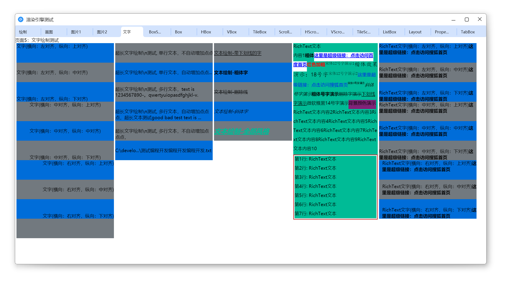
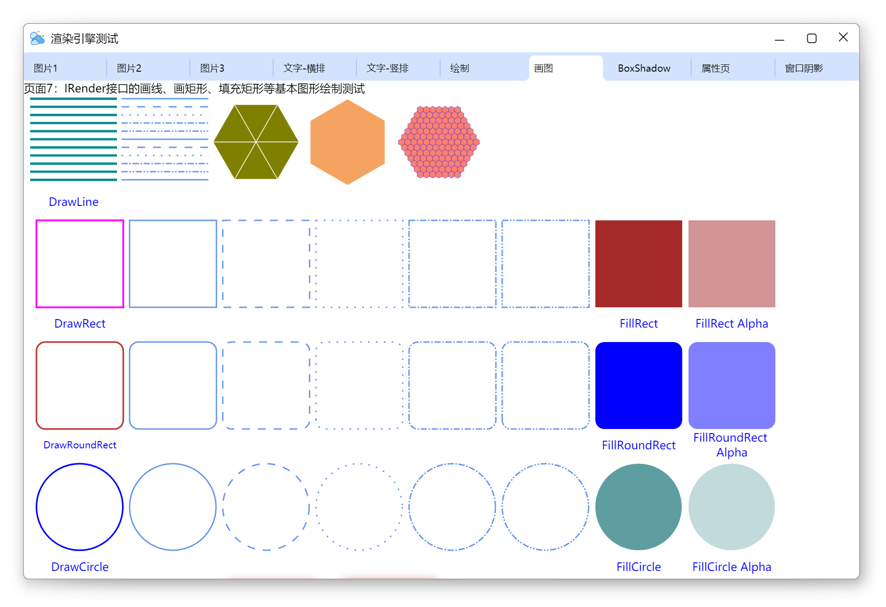

## 11. examples/RichEdit
演示如何使用RichEdit控件。    
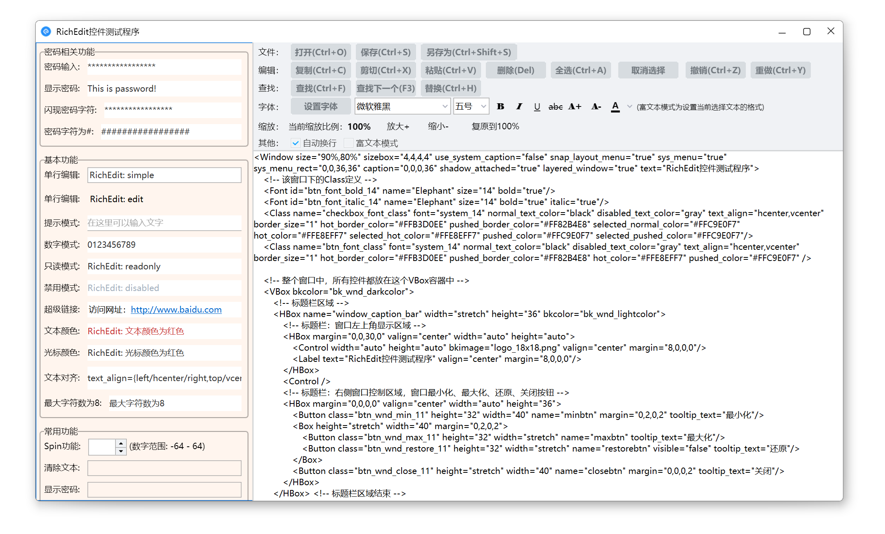

## 12. examples/TreeView
演示如何使用TreeView控件。    
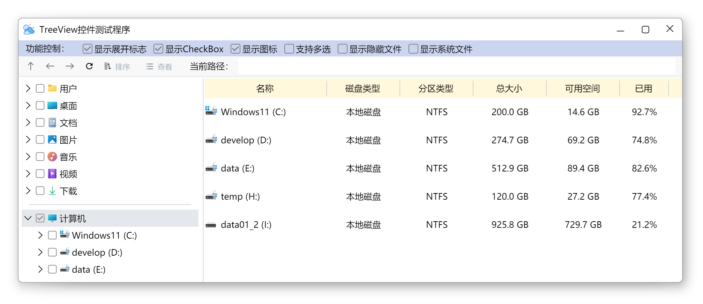
    
## 13. examples/VirtualListBox
演示如何使用基于虚表实现的ListBox容器。    
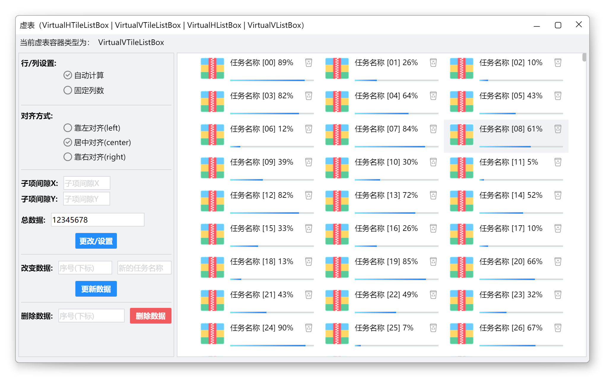
 