## 示例程序
examples 目录中包含了一些示例程序，可以参考这些示例程序来完善自己的应用程序。

## 1. examples/basic
一个基础的窗口示例程序，带有最小化、最大化、还原和关闭按钮。    

## 2. examples/ColorPicker
演示如何使用拾色器控件的程序。    

## 3. examples/controls
一些常用控件的样式使用方法示例。    

## 4. examples/chat
包含一个登录窗口和一个模拟 PC 聊天布局的窗口示例。    
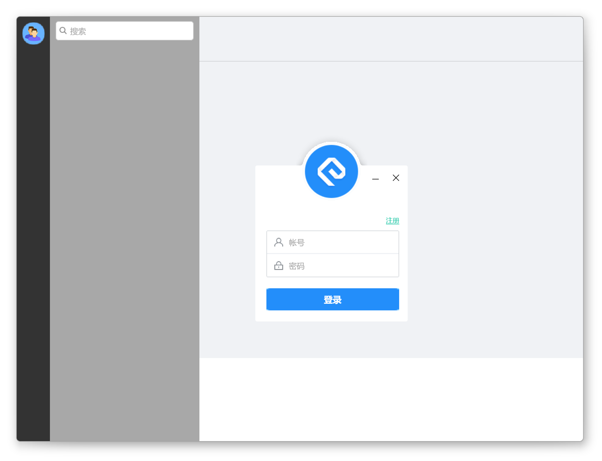

## 5. examples/ListBox
演示如何使用ListBox容器的程序。    

    
## 6. examples/ListCtrl
演示如何使用ListCtrl控件。    

## 7. examples/MoveControl
演示如何使用Box容器的"drag_out_id"和"drop_in_id"属性来实现控件在不同容器之间的移动效果。    
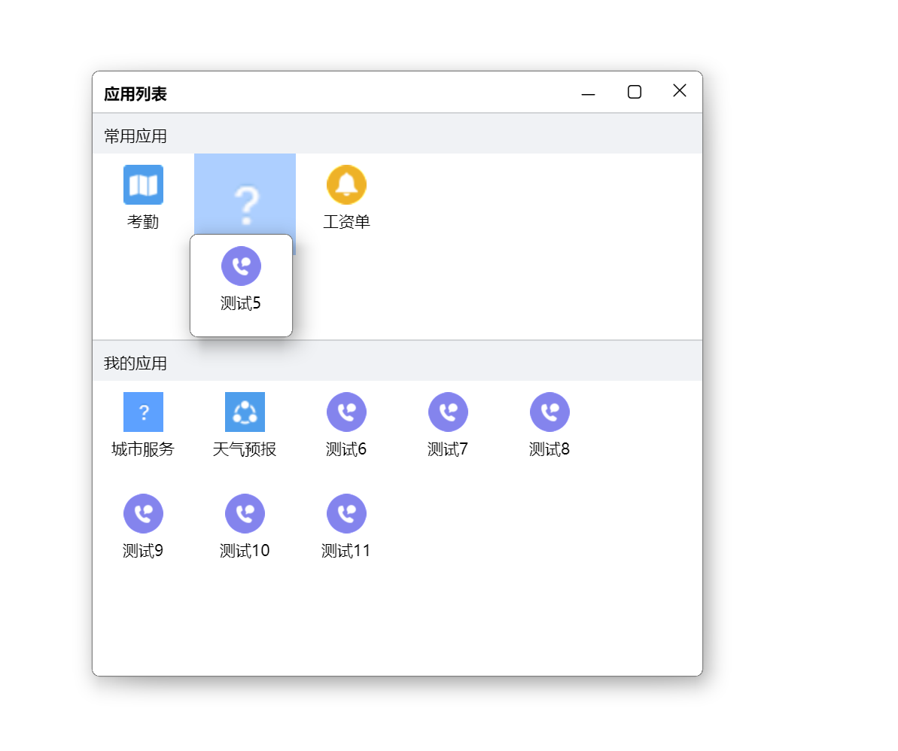
   
## 8. examples/render
演示如何使用渲染引擎的程序，同时也包含了各种控件/容器的使用示例。    

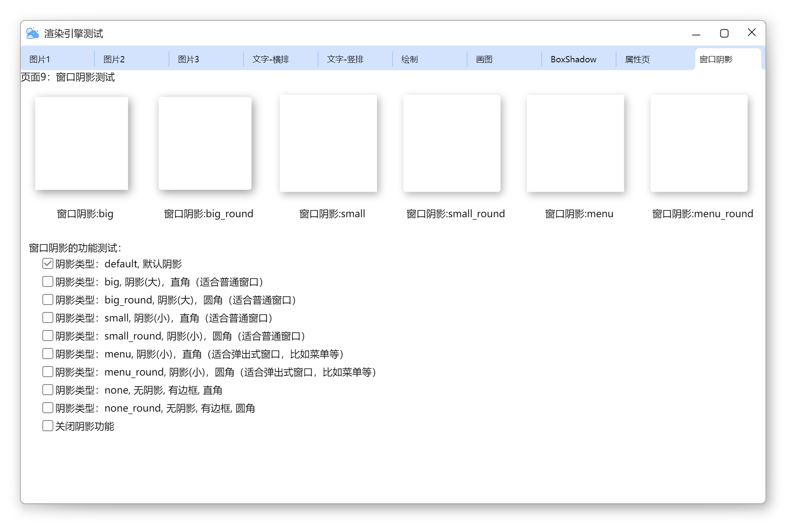

## 9. examples/RichEdit
演示如何使用RichEdit控件。    

## 10. examples/TreeView
演示如何使用TreeView控件。    

    
## 11. examples/VirtualListBox
演示如何使用基于虚表实现的ListBox容器。    

    
## 12. examples/MultiLang
演示如何使用多语言功能，支持多语言的动态切换。    
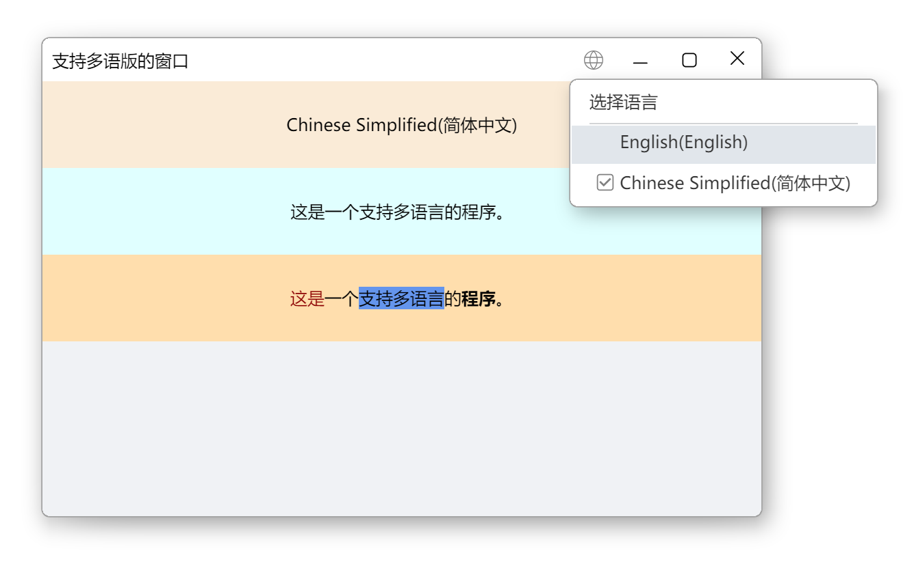

## 13. examples/DpiAware
演示如何使用DPI感知功能，如何动态设置窗口的DPI。    
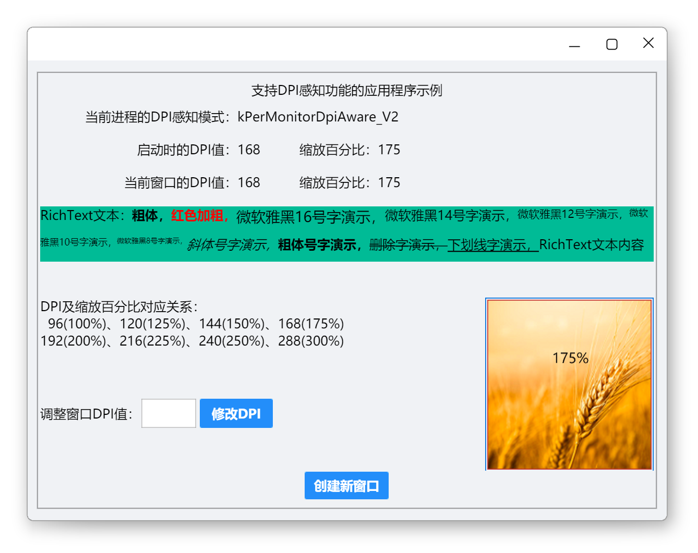

## 14. examples/threads
演示如何使用多线程功能，包含多线程通信等。    
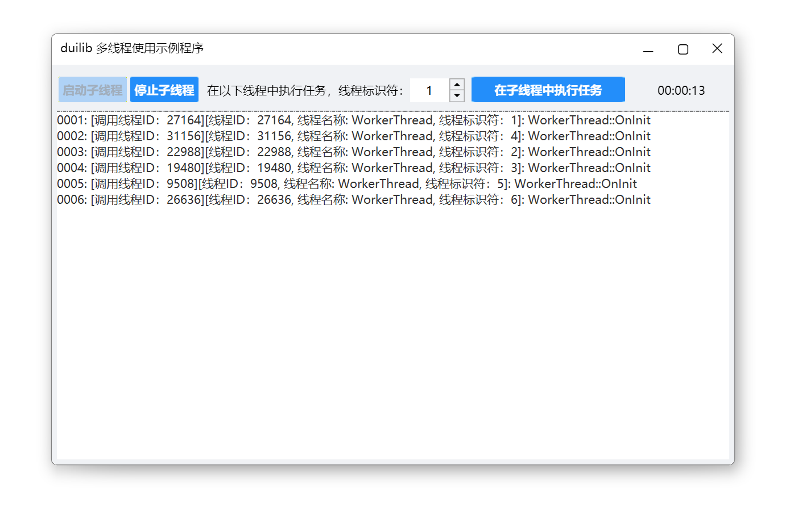

## 15. examples/layout
演示容器的各种布局。    
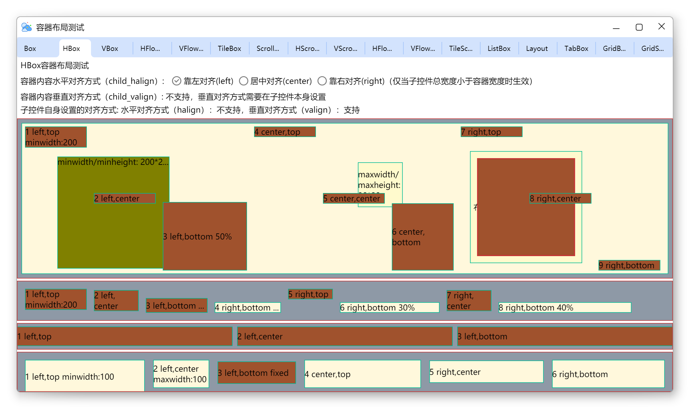

## 16. examples/cef
演示如何在使用 CEF 控件，包含 C++ 与 JavaScript 交互。    

## 17. examples/CefBrowser
基于 CEF 的自定义多标签可拖曳浏览器示例。    
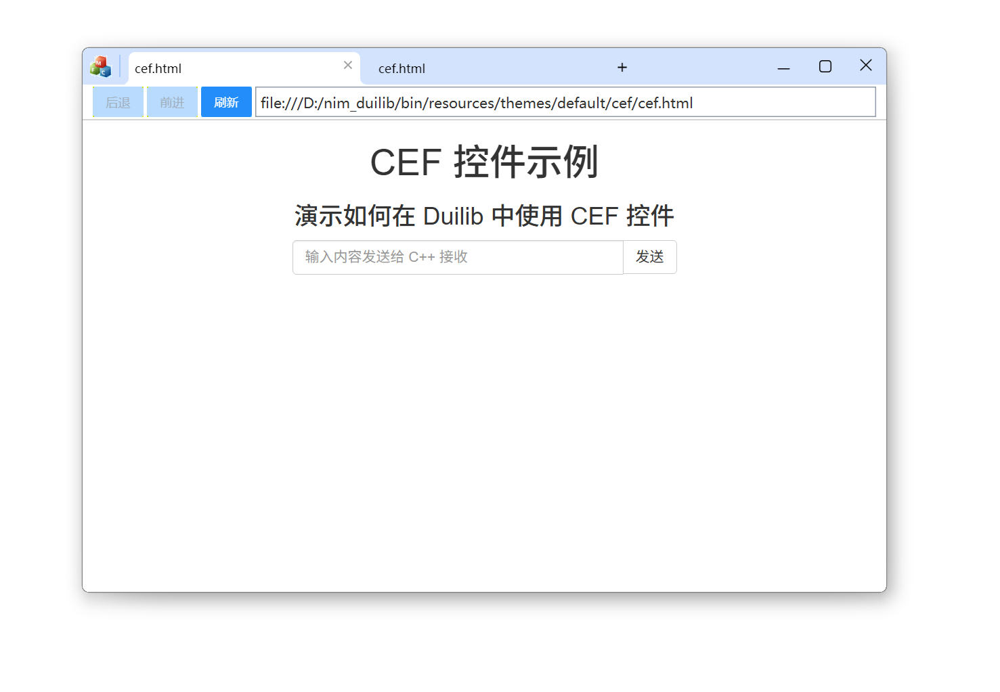
    
## 18. examples/WebView2
演示如何在使用 WebView2 控件。    
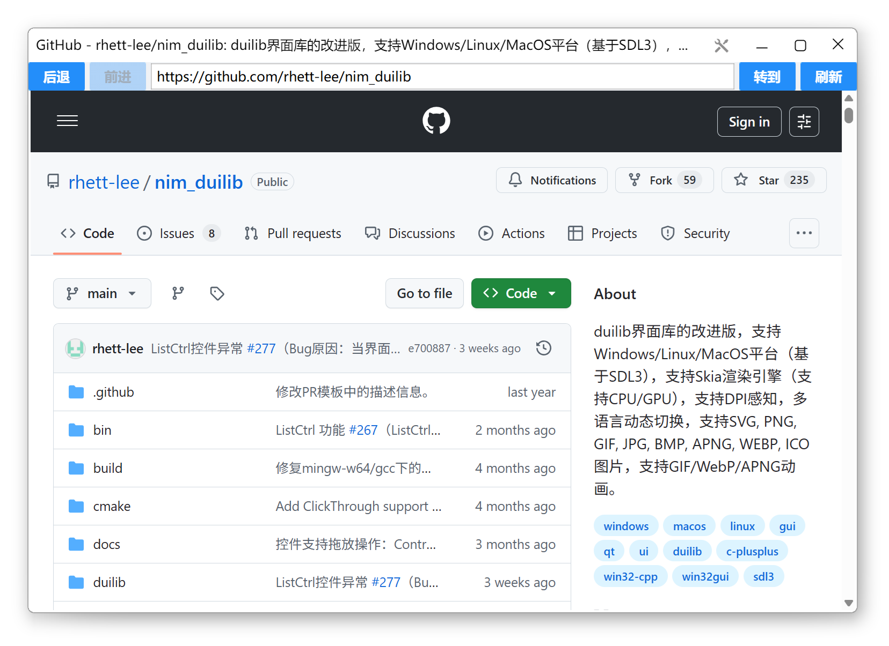

## 19. examples/WebView2Browser
基于 WebView2 的自定义多标签可拖曳浏览器示例。    
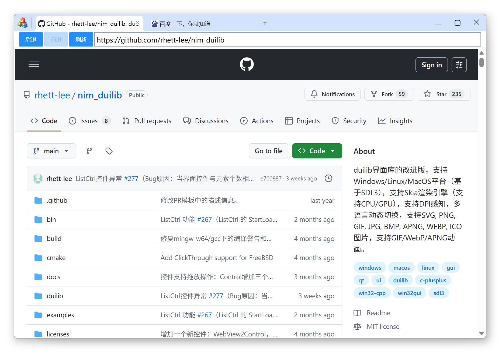
    
## 20. examples/ChildWindow    
子窗口控件的功能演示示例。    
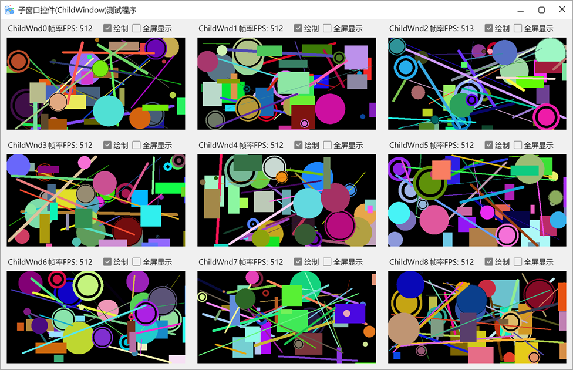
    
## 21. examples/XmlPreview    
XML文件的界面效果预览功能演示示例。    

