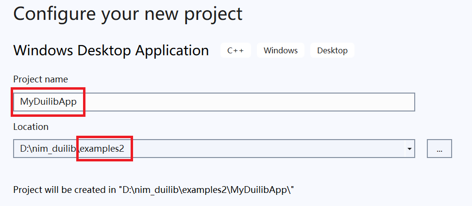
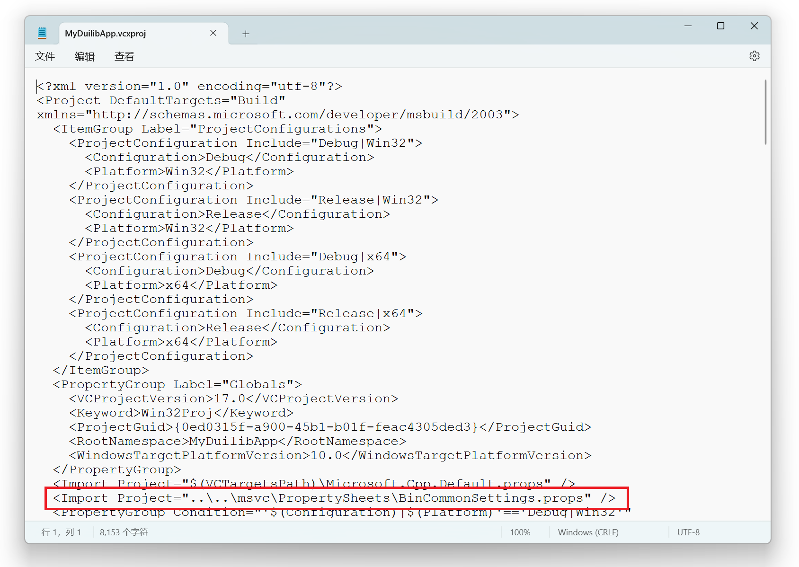
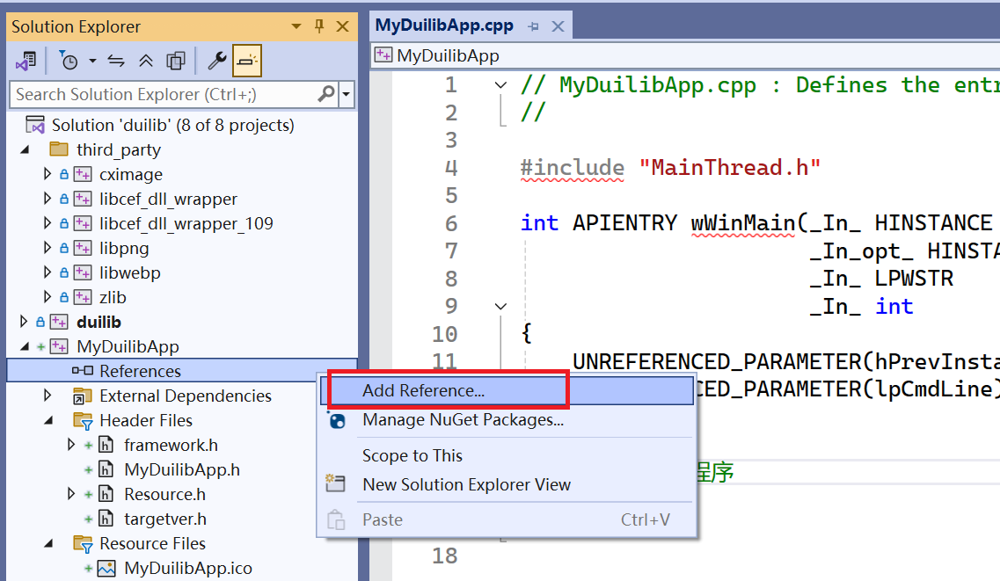
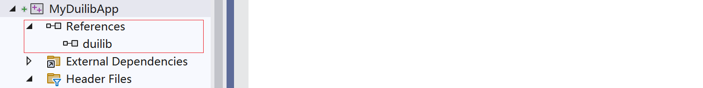

English | [简体中文](Getting-Started.md)

> Last synced: 2026-09-29

# Quick Start (Windows, using VS 2022 as an example)

This example will guide you to quickly deploy a basic application based on nim_duilib. This example is similar to the `basic` project in `examples`; if you prefer to read code, you can open the `examples.sln` project and refer to the example code without spending extra time.

## Get the project code and build

1. Get the project code

```bash
git clone https://github.com/rhett-lee/nim_duilib
```

2. Get the build method and modified code for skia (nim_duilib uses skia as its rendering engine, so skia must be built first)

```bash
git clone https://github.com/rhett-lee/skia_compile
```

3. Compile the skia source code: build the skia-related lib files according to the method in the skia_compile project documentation [compile_skia_on_windows.en.md](https://github.com/rhett-lee/skia_compile/blob/main/compile_skia_on_windows.en.md).    
   Note: the skia source code should be located in the same directory as the nim_duilib source code.    
   Note: when compiling the skia source code, LLVM should be used so that the program runs smoothly; if compiled with VS, the running speed is very slow and the UI is laggy.    
   Check method: after a successful build, the skia.lib and other lib files are generated in a subdirectory of skia/out.
4. The basic structure of the source code directories of several projects within the working directory is as follows    


5. Compile nim_duilib: enter the `nim_duilib` directory, open `examples.sln` with Visual Studio, select the build option Debug|x64 or Release|x64, and press F7 to build all example programs (the built example programs are located in the bin directory).

## Create a basic project

Open the `examples.sln` solution in the project directory using Visual Studio, create a new Windows desktop application, and complete your first program based on the duilib GUI library step by step.

1. Create a new Windows desktop application in the `examples.sln` solution (VS2022, application type: Windows Desktop Application).
Assume the program name is: `MyDuilibApp`, and the source code is placed in the `examples` subdirectory.    



2. Clean up the generated code, keeping only the essential wWinMain function:
```cpp
#include "MainThread.h"

int APIENTRY wWinMain(_In_ HINSTANCE hInstance,
                     _In_opt_ HINSTANCE hPrevInstance,
                     _In_ LPWSTR    lpCmdLine,
                     _In_ int       nCmdShow)
{
    UNREFERENCED_PARAMETER(hPrevInstance);
    UNREFERENCED_PARAMETER(lpCmdLine);


    //Exit the program normally
    return 0;
}
```

## Configure project properties
- Use the common configuration provided by nim_duilib (`msvc\PropertySheets\BinCommonSettings.props`)    
（1）Open the just-created project file (`examples\MyDuilibApp\MyDuilibApp.vcxproj`) with a text editor    
（2）Find the line `<Import Project="$(VCTargetsPath)\Microsoft.Cpp.Default.props" />` and insert a line after it, adding the following content:    
         `<Import Project="..\..\msvc\PropertySheets\BinCommonSettings.props" />`    
（3）Save the changes to the project file; if it is already open in VS, it needs to be reloaded.    



- Right-click the project -> Add -> Reference, and add duilib as a reference project, so that you do not need to manually import library files.



After a successful addition, you can see the successfully referenced project:    
  

## Introduce the thread library

Add a custom thread class MainThread to the created project (a main thread and a worker thread)    
Create two files (`MainThread.h` and `MainThread.cpp`), and add them to the VS project. The contents of the two files are as follows:

MainThread.h    
```cpp
#ifndef EXAMPLES_MAIN_THREAD_H_
#define EXAMPLES_MAIN_THREAD_H_

// duilib
#include "duilib/duilib.h"

/** Main thread
*/
class MainThread : public ui::FrameworkThread
{
public:
    MainThread();
    virtual ~MainThread() override;

private:
    /** Initialization before running, called before entering the message loop; if initialization fails, the message loop is not entered
    * @return returns true if initialization succeeds, false if it fails
    */
    virtual bool OnInit() override;

    /** Cleanup on exit, called after exiting the message loop
    */
    virtual void OnCleanup() override;
};

#endif // EXAMPLES_MAIN_THREAD_H_
```

MainThread.cpp    
```cpp
#include "MainThread.h"
#include "MainForm.h"

MainThread::MainThread() :
    FrameworkThread(_T("MainThread"), ui::kThreadUI)
{
}

MainThread::~MainThread()
{
}

bool MainThread::OnInit()
{
    //Initialize global resources, using a local folder as the resource
    ui::FilePath resourcePath = ui::GlobalManager::GetResourceRootPath(false);
    ui::GlobalManager::Instance().Startup(ui::LocalFilesResParam(resourcePath));

    //Add the startup window code below
    //
    //Create a centered window with a default shadow
    MainForm* window = new MainForm();
    window->CreateWnd(nullptr, ui::WindowCreateParam(_T("MyDuilibApp"), true));
    window->PostQuitMsgWhenClosed(true);
    window->ShowWindow(ui::kSW_SHOW_NORMAL);
    return true;
}

void MainThread::OnCleanup()
{
    ui::GlobalManager::Instance().Shutdown();
}
```

In wWinMain, instantiate the main thread object and call to run the main thread loop. After adding, the wWinMain function is modified as follows:

```cpp
#include "MainThread.h"

int APIENTRY wWinMain(_In_ HINSTANCE hInstance,
                     _In_opt_ HINSTANCE hPrevInstance,
                     _In_ LPWSTR    lpCmdLine,
                     _In_ int       nCmdShow)
{
    UNREFERENCED_PARAMETER(hPrevInstance);
    UNREFERENCED_PARAMETER(lpCmdLine);

    //Create the main thread
    MainThread thread;

    //Run the main thread message loop
    thread.RunMessageLoop();

    //Exit the program normally
    return 0;
}
```

## Create a simple window

Create a window class MainForm, inheriting from the `ui::WindowImplBase` class, and overriding methods such as `GetSkinFolder` and `GetSkinFile`.

```cpp
//MainForm.h
#ifndef EXAMPLES_MAIN_FORM_H_
#define EXAMPLES_MAIN_FORM_H_

// duilib
#include "duilib/duilib.h"

/** Implementation of the application's main window
*/
class MainForm : public ui::WindowImplBase
{
    typedef ui::WindowImplBase BaseClass;
public:
    MainForm();
    virtual ~MainForm() override;

    /**  Called when the window is created, implemented by the subclass to obtain the window skin directory
    * @return the subclass must implement and return the window skin directory
    */
    virtual DString GetSkinFolder() override;

    /**  Called when the window is created, implemented by the subclass to obtain the window skin XML description file
    * @return the subclass must implement and return the window skin XML description file
    *         The returned content can be the XML file content (a string starting with the character '<'),
    *         or a file path (a string not starting with '<'); the file must be findable in the path returned by GetSkinFolder()
    */
    virtual DString GetSkinFile() override;

    /** Called after the window is created, for the subclass to do some initialization work
    */
    virtual void OnInitWindow() override;
};

#endif //EXAMPLES_MAIN_FORM_H_
```

```cpp
//MainForm.cpp
#include "MainForm.h"

MainForm::MainForm()
{
}

MainForm::~MainForm()
{
}

DString MainForm::GetSkinFolder()
{
    return _T("my_duilib_app");
}

DString MainForm::GetSkinFile()
{
    return _T("MyDuilibForm.xml");
}

void MainForm::OnInitWindow()
{
    BaseClass::OnInitWindow();
    //Window initialization is complete; you can now perform initialization for this Form

}
```

## Create the window description XML file

In the window class we created, we specified the window description file directory as `my_duilib_app` and the window description file as `MyDuilibForm.xml`.
Next, create the `my_duilib_app` folder under the `bin\resources\themes\default` directory and create a new `MyDuilibForm.xml` file, then write the following content.    
Note: the XML file encoding format is UTF-8.  
```xml
<?xml version="1.0" encoding="UTF-8"?>
<Window size="75%,75%" min_size="240,100"
        caption="0,0,0,36" use_system_caption="false" snap_layout_menu="true" sys_menu="true" sys_menu_rect="0,0,36,36"
        shadow_type="default" shadow_snap="true"
        size_box="4,4,4,4" icon="public/caption/logo.ico">
    <!-- All controls in the entire window are placed in this VBox container -->
    <VBox bkcolor="bg_window_main">
        <!-- Title bar area -->
        <HBox name="window_title_bar" width="stretch" height="36" bkcolor="bg_titlebar">
            <!-- Title bar: display area at the top-left of the window -->
            <Control mouse_enabled="false"/>
            <!-- Title bar: window control area on the right, with window minimize, maximize, restore and close buttons -->
            <HBox margin="0,0,0,0" valign="center" width="auto" height="36">
                <Button class="btn_switch_theme" height="32" width="40" name="btn_window_theme" margin="0,2,0,2"/>
                <Button class="btn_switch_lang" height="32" width="40" name="btn_window_language" margin="0,2,0,2"/>
                <Button class="btn_wnd_fullscreen_11" height="32" width="40" name="btn_window_fullscreen" margin="0,2,0,2"/>
                <Button class="btn_wnd_min_11" height="32" width="40" name="btn_window_min" margin="0,2,0,2"/>
                <Box height="stretch" width="40" margin="0,2,0,2">
                    <Button class="btn_wnd_max_11" height="32" width="stretch" name="btn_window_max"/>
                    <Button class="btn_wnd_restore_11" height="32" width="stretch" name="btn_window_restore" visible="false"/>
                </Box>
                <Button class="btn_wnd_close_11" height="stretch" width="40" name="btn_window_close" margin="0,0,0,2"/>
            </HBox>
        </HBox>
        <!-- End of title bar area -->

        <!-- Working area: everything other than the title bar is placed in this large Box area -->
        <Box bkcolor="bg_container">
            <VBox margin="0,0,0,0" valign="center" halign="center">
                <Label name="tooltip" text="This is a simple nim_duilib window, with a title bar and regular buttons." height="100%" width="100%" text_align="hcenter,vcenter"/>
            </VBox>
        </Box>
    </VBox>
</Window>
```

## Display the window

In the `MainThread::OnInit` method of the main thread, create the window and display it centered; before creating the window, include the window's header file. The modified code is as follows:    
(First, include the header file in the file: `#include "MainForm.h"`)

```cpp
bool MainThread::OnInit()
{
    //Initialize global resources, using a local folder as the resource
    ui::FilePath resourcePath = ui::GlobalManager::GetResourceRootPath(false);
    ui::GlobalManager::Instance().Startup(ui::LocalFilesResParam(resourcePath));

    //Add the startup window code below
    //
    //Create a centered window with a default shadow
    MainForm* window = new MainForm();
    window->CreateWnd(nullptr, ui::WindowCreateParam(_T("MyDuilibApp"), true));
    window->PostQuitMsgWhenClosed(true);
    window->ShowWindow(ui::kSW_SHOW_NORMAL);
    return true;
}
```

In this way, a simple window with minimize, maximize, restore and close buttons, a fullscreen button, a shadow effect, and a line of text hint is created. You can compile and run the following code to see the window effect.
   
## Using libCEF in the program
You can refer to the related documentation [CEF.md](CEF.en.md)

## About Visual Studio project configuration
The Visual Studio project configuration in the project uses property sheets, stored in the following directory: `nim_duilib\msvc\PropertySheets`
    
## How to set the source code file encoding to UTF-8 format
1. Create a format configuration file in the project root directory, named: .editorconfig
2. The file content is as follows:
```
# Visual Studio generated .editorconfig file with C++ settings.
root = true

[*.{c,c++,cc,cpp,cppm,cxx,h,h++,hh,hpp,hxx,inl,ipp,ixx,tlh,tli}]

# Visual C++ Formatting settings

end_of_line = crlf               # Line ending format; allowed values: lf (Unix style), cr (Mac style), or crlf (Windows style)
charset = utf-8                  # File encoding character set is UTF-8 (allowed values: utf-8, utf-8-bom, latin1, etc.)
trim_trailing_whitespace = true  # Remove trailing whitespace at end of file
insert_final_newline = true      # Insert a final newline at the end
indent_style = space             # Use spaces instead of tabs
indent_size = 4                  # Number of spaces to replace a tab
tab_width = 4                    # Width of a tab character
```
3. This method applies to Visual Studio 2022.
