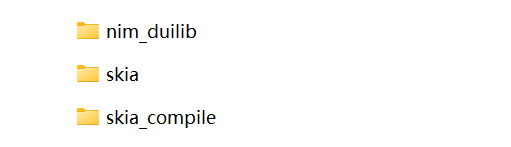

# 快速上手（Windows系统，VS 2022）

此示例将引导你快速部署一个基于 nim_duilib 的基本应用，此示例与 `examples` 中的 `MyDuilibApp` 项目一致，如果你更喜欢查看代码，可以打开`examples.sln`工程，参考示例代码而无需多花费时间。

## 获取项目代码并编译

1. 获取项目代码

```bash
git clone https://github.com/rhett-lee/nim_duilib
```

2. 获取skia代码的编译方法和修改的代码（nim_duilib使用skia作为绘制引擎，所以先要编译skia）

```bash
git clone https://github.com/rhett-lee/skia_compile
```

3. 编译skia源码：按照skia_compile目录中的[Windows下编译skia.md文档](../../skia_compile/Windows下编译skia.md)中的方法，编译出skia相关的lib文件    
   注意事项：skia源码应该与nim_duilib源码位于相同的目录下。    
   注意事项：skia源码编译的时候，应使用LLVM编译，程序运行比较流畅；如果使用VS编译，运行速度很慢，界面比较卡。    
   检查方法：编译成功以后，在skia/out的子目录下，有生成skia.lib等lib文件。
4. 在工作目录内，几个项目的源码目录的基本结构如下    



5. 编译nim_duilib：进入 `nim_duilib` 目录，使用 Visual Studio 2022版本的 IDE 打开 `examples.sln`，选择编译选项为Debug|x64或者Release|x64，按下 F7 即可编译所有示例程序（编译完成的示例程序位于bin目录中）。

## 创建基础工程

使用 Visual Studio 打开项目目录中 `duilib.sln` 解决方案，
解决方案中包含了一些简单示例作为参考，你可以参考示例或新建一个 Windows 桌面应用，来一步一步完成第一个 duilib 窗口。

1. 在`duilib.sln` 解决方案中新建一个 Windows 桌面程序（VS2022，程序类型为：Windows Desktop Application）。
假定程序名为：`MyDuilibApp`，源码放在`examples2`子目录中。    


2. 将生成的代码清理一下，只保留关键的 wWinMain 函数：
```cpp
#include "MainThread.h"

int APIENTRY wWinMain(_In_ HINSTANCE hInstance,
                     _In_opt_ HINSTANCE hPrevInstance,
                     _In_ LPWSTR    lpCmdLine,
                     _In_ int       nCmdShow)
{
    UNREFERENCED_PARAMETER(hPrevInstance);
    UNREFERENCED_PARAMETER(lpCmdLine);


    //正常退出程序
    return 0;
}
```

## 配置项目属性
- 使用nim_duilib提供的通用配置（`MSVC\PropertySheets\CommonSettings.props`）    
（1）用文本编辑器打开刚刚创建的工程文件（`examples2\MyDuilibApp\MyDuilibApp.vcxproj`）    
（2）找到`<Import Project="$(VCTargetsPath)\Microsoft.Cpp.Default.props" />`这一行的位置，在这行的后面插入一行，添加一下内容：    
         `<Import Project="$(SolutionDir)\MSVC\PropertySheets\CommonSettings.props" />`    
（3）保存该工程文件的修改，如果已经在VS中打开，需要重新加载。    


- 项目右键->添加->引用，将 duilib、cximage、libpng、libwebp、zlib 作为引用项目，这样就不需要手动引入静态库文件了。


添加成功后，可以看到引用成功的项目：    
  

## 引入线程库

在创建的项目中增加自定义的线程类MainThread（主线程和一个工作线程）    
创建两个文件（`MainThread.h` 和 `MainThread.cpp`），并添加到VS工程中，两个文件的内容分别如下：

```cpp
#ifndef EXAMPLES_MAIN_THREAD_H_
#define EXAMPLES_MAIN_THREAD_H_

// duilib
#include "duilib/duilib.h"

/** 工作线程
*/
class WorkerThread : public ui::FrameworkThread
{
public:
    WorkerThread();
    virtual ~WorkerThread() override;

private:
    /** 运行前初始化，在进入消息循环前调用
    */
    virtual void OnInit() override;

    /** 退出时清理，在退出消息循环后调用
    */
    virtual void OnCleanup() override;
};

/** 主线程
*/
class MainThread : public ui::FrameworkThread
{
public:
    MainThread();
    virtual ~MainThread() override;

private:
    /** 运行前初始化，在进入消息循环前调用
    */
    virtual void OnInit() override;

    /** 退出时清理，在退出消息循环后调用
    */
    virtual void OnCleanup() override;

private:
    /** 工作线程(如果不需要多线程处理业务，可以移除工作线程的代码)
    */
    std::unique_ptr<WorkerThread> m_workerThread;
};

#endif // EXAMPLES_MAIN_THREAD_H_
```

```cpp
#include "MainThread.h"
#include "MainForm.h"

WorkerThread::WorkerThread()
    : FrameworkThread(_T("WorkerThread"), ui::kThreadWorker)
{
}

WorkerThread::~WorkerThread()
{
}

void WorkerThread::OnInit()
{
#if defined (DUILIB_BUILD_FOR_WIN) && !defined (DUILIB_BUILD_FOR_SDL)
    ::OleInitialize(nullptr);
#endif
}

void WorkerThread::OnCleanup()
{
#if defined (DUILIB_BUILD_FOR_WIN) && !defined (DUILIB_BUILD_FOR_SDL)
    ::OleUninitialize();
#endif
}

MainThread::MainThread() :
    FrameworkThread(_T("MainThread"), ui::kThreadUI)
{
}

MainThread::~MainThread()
{
}

void MainThread::OnInit()
{
#if defined (DUILIB_BUILD_FOR_WIN) && !defined (DUILIB_BUILD_FOR_SDL)
    ::OleInitialize(nullptr);
#endif

    //启动工作线程
    m_workerThread.reset(new WorkerThread);
    m_workerThread->Start();

    //初始化全局资源, 使用本地文件夹作为资源
    ui::FilePath resourcePath = ui::FilePathUtil::GetCurrentModuleDirectory();
    resourcePath += _T("resources\\");
    ui::GlobalManager::Instance().Startup(ui::LocalFilesResParam(resourcePath));

    //在下面加入启动窗口代码
    //
    //创建一个默认带有阴影的居中窗口
    MainForm* window = new MainForm();
    window->CreateWnd(nullptr, ui::WindowCreateParam(_T("MyDuilibApp"), true));
    window->PostQuitMsgWhenClosed(true);
    window->ShowWindow(ui::kSW_SHOW_NORMAL);
}

void MainThread::OnCleanup()
{
    if (m_workerThread != nullptr) {
        m_workerThread->Stop();
        m_workerThread.reset(nullptr);
    }
    ui::GlobalManager::Instance().Shutdown();
#if defined (DUILIB_BUILD_FOR_WIN) && !defined (DUILIB_BUILD_FOR_SDL)
    ::OleUninitialize();
#endif
}
```

在 wWinMain 实例化主线程对象，并调用执行主线程循环，添加后 wWinMain 函数修改如下：

```cpp
// MyDuilibApp.cpp : Defines the entry point for the application.
//

#include "MainThread.h"

int APIENTRY wWinMain(_In_ HINSTANCE hInstance,
                     _In_opt_ HINSTANCE hPrevInstance,
                     _In_ LPWSTR    lpCmdLine,
                     _In_ int       nCmdShow)
{
    UNREFERENCED_PARAMETER(hPrevInstance);
    UNREFERENCED_PARAMETER(lpCmdLine);

    //创建主线程
    MainThread thread;

    //执行主线程消息循环
    thread.RunOnCurrentThreadWithLoop();

    //正常退出程序
    return 0;
}
```

## 创建一个简单窗口

创建一个窗口类MainForm，继承 `ui::WindowImplBase` 类，并覆写 `GetSkinFolder` `GetSkinFile` 等方法。

```cpp
//MainForm.h
#ifndef EXAMPLES_MAIN_FORM_H_
#define EXAMPLES_MAIN_FORM_H_

// duilib
#include "duilib/duilib.h"

/** 应用程序的主窗口实现
*/
class MainForm : public ui::WindowImplBase
{
    typedef ui::WindowImplBase BaseClass;
public:
    MainForm();
    virtual ~MainForm() override;

    /**  创建窗口时被调用，由子类实现用以获取窗口皮肤目录
    * @return 子类需实现并返回窗口皮肤目录
    */
    virtual DString GetSkinFolder() override;

    /**  创建窗口时被调用，由子类实现用以获取窗口皮肤 XML 描述文件
    * @return 子类需实现并返回窗口皮肤 XML 描述文件
    *         返回的内容，可以是XML文件内容（以字符'<'为开始的字符串），
    *         或者是文件路径（不是以'<'字符开始的字符串），文件要在GetSkinFolder()路径中能够找到
    */
    virtual DString GetSkinFile() override;

    /** 当窗口创建完成以后调用此函数，供子类中做一些初始化的工作
    */
    virtual void OnInitWindow() override;
};

#endif //EXAMPLES_MAIN_FORM_H_
```

```cpp
//MainForm.cpp
#include "MainForm.h"

MainForm::MainForm()
{
}

MainForm::~MainForm()
{
}

DString MainForm::GetSkinFolder()
{
    return _T("my_duilib_app");
}

DString MainForm::GetSkinFile()
{
    return _T("MyDuilibForm.xml");
}

void MainForm::OnInitWindow()
{
    BaseClass::OnInitWindow();
    //窗口初始化完成，可以进行本Form的初始化

}
```

## 创建窗口描述 XML 文件

在我们创建的窗口类中，指定了窗口描述文件目录是 `my_duilib_app`，指定窗口的描述文件为 `MyDuilibForm.xml`。
接下来在 `bin\resources\themes\default` 目录下创建 `my_duilib_app` 文件夹并新建一个 `MyDuilibForm.xml` 文件，写下如下内容。    
注意事项：XML文件的编码格式是UTF-8。  
```xml
<?xml version="1.0" encoding="UTF-8"?>
<Window size="800,600" mininfo="80,60" 
        caption="0,0,0,36" use_system_caption="false" snap_layout_menu="true" sys_menu="true" sys_menu_rect="0,0,36,36" 
        shadow_type="default" shadow_attached="true" layered_window="true" 
        alpha="255" sizebox="4,4,4,4" icon="../public/caption/logo.ico">
    <VBox bkcolor="bk_wnd_darkcolor" visible="true">    
        <!-- 标题栏区域 -->
        <HBox name="window_caption_bar" width="stretch" height="36" bkcolor="bk_wnd_lightcolor">
            <Control />
            <Button class="btn_wnd_fullscreen_11" height="32" width="40" name="fullscreenbtn" margin="0,2,0,2" tooltip_text="全屏，按ESC键可退出全屏"/>
            <Button class="btn_wnd_min_11" height="32" width="40" name="minbtn" margin="0,2,0,2" tooltip_text="最小化"/>
            <Box height="stretch" width="40" margin="0,2,0,2">
                <Button class="btn_wnd_max_11" height="32" width="stretch" name="maxbtn" tooltip_text="最大化"/>
                <Button class="btn_wnd_restore_11" height="32" width="stretch" name="restorebtn" visible="false" tooltip_text="还原"/>
            </Box>
            <Button class="btn_wnd_close_11" height="stretch" width="40" name="closebtn" margin="0,0,0,2" tooltip_text="关闭"/>
        </HBox>
        
        <!-- 工作区域，除了标题栏外的内容都放在这个大的Box区域 -->
        <Box>
            <VBox margin="0,0,0,0" valign="center" halign="center">
                <Label name="tooltip" text="这是一个简单的nim_duilib窗口，带有标题栏和常规按钮。" height="100%" width="100%" text_align="hcenter,vcenter"/>        
            </VBox>
        </Box>
    </VBox>
</Window>
```

## 显示窗口

在主线程的 MainThread::Init 方法中，创建窗口并居中显示，创建窗口前先引入窗口的头文件，修改后的代码如下：    
（首先在文件中包含头文件：`#include "MainForm.h"`）

```cpp
void MainThread::OnInit()
{
#if defined (DUILIB_BUILD_FOR_WIN) && !defined (DUILIB_BUILD_FOR_SDL)
    ::OleInitialize(nullptr);
#endif

    //启动工作线程
    m_workerThread.reset(new WorkerThread);
    m_workerThread->Start();

    //初始化全局资源, 使用本地文件夹作为资源
    ui::FilePath resourcePath = ui::FilePathUtil::GetCurrentModuleDirectory();
    resourcePath += _T("resources\\");
    ui::GlobalManager::Instance().Startup(ui::LocalFilesResParam(resourcePath));

    //在下面加入启动窗口代码
    //
    //创建一个默认带有阴影的居中窗口
    MainForm* window = new MainForm();
    window->CreateWnd(nullptr, ui::WindowCreateParam(_T("MyDuilibApp"), true));
    window->PostQuitMsgWhenClosed(true);
    window->ShowWindow(ui::kSW_SHOW_NORMAL);
}
```

这样一个简单的带有最小化、最大化、还原和关闭按钮、全屏按钮，具有阴影效果和一行文字提示的窗口就创建出来了，你可以编译运行以下代码看一看窗口效果。


    
## 如何设置项目中使用的源代码文件编码为UTF-8格式
1. 在项目根目录创建一个格式配置文件，文件名为：.editorconfig
2. 文件内容如下：
```
# Visual Studio generated .editorconfig file with C++ settings.
root = true

[*.{c,c++,cc,cpp,cppm,cxx,h,h++,hh,hpp,hxx,inl,ipp,ixx,tlh,tli}]

# Visual C++ Formatting settings

end_of_line = crlf               # 行尾格式，可选值为 lf（Unix 风格）、cr（Mac 风格）或 crlf（Windows 风格）
charset = utf-8                  # 文件编码字符集为 UTF-8（可选值为 utf-8、utf-8-bom、latin1 等）
trim_trailing_whitespace = true  # 删除文件末尾空格
insert_final_newline = true      # 末尾插入新行
indent_style = space             # 以空格代替 tab
indent_size = 4                  # 代替 tab 的空格数量
tab_width = 4                    # 制表符的宽度
```
3. 该方法适用于Visual Studio 2022。