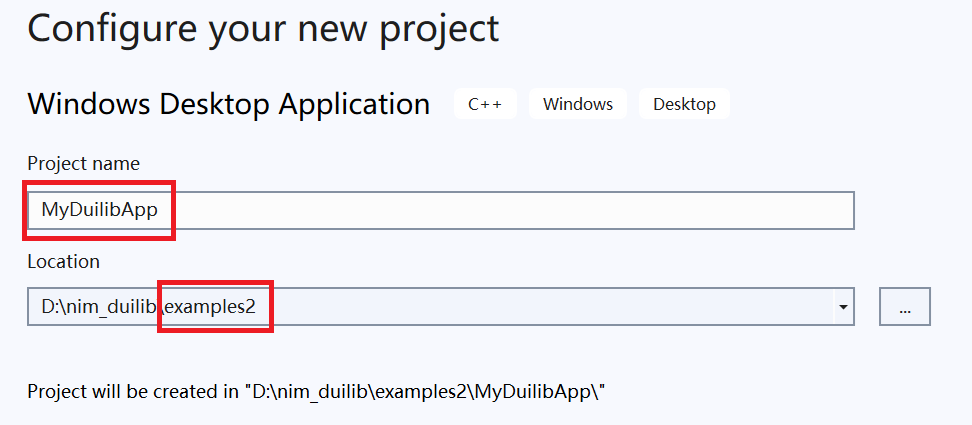
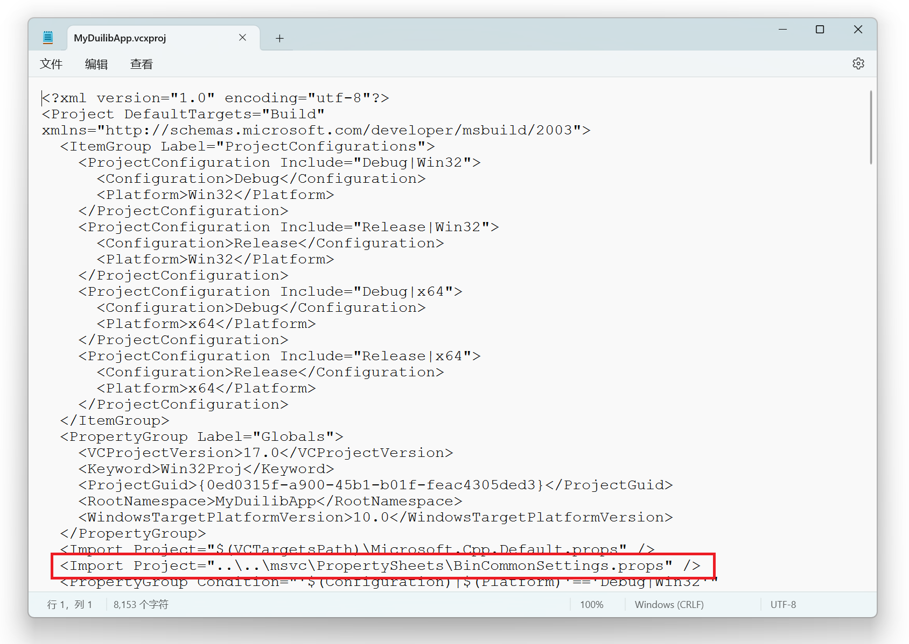
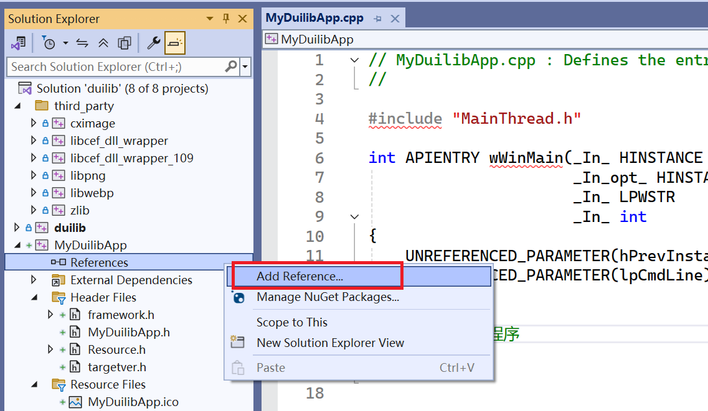
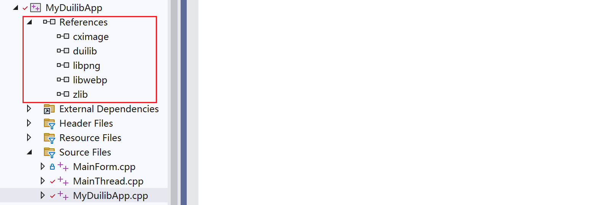
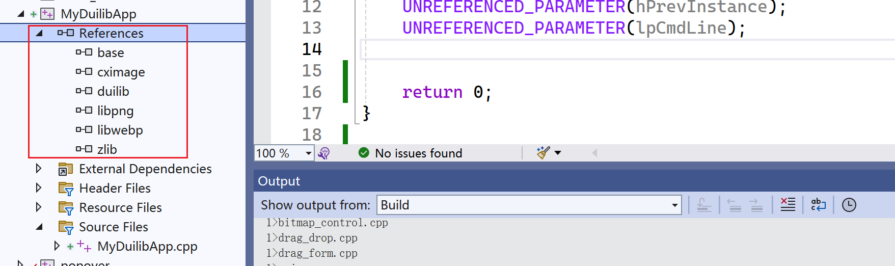
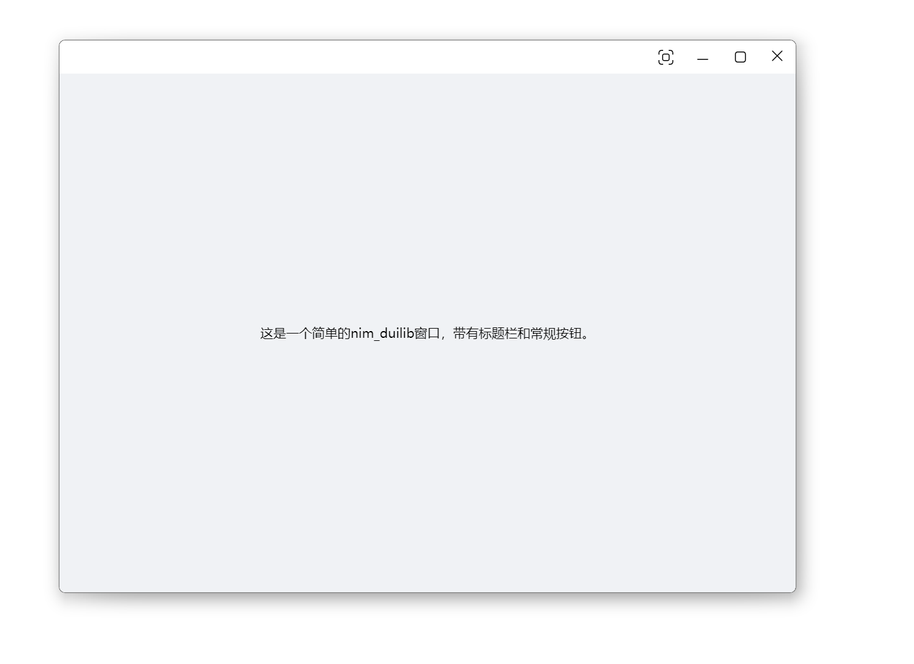

# 快速上手

此示例将引导你快速部署一个基于 nim_duilib 的基本应用，此示例与 `samples` 中的 `MyDuilibApp` 项目一致，如果你更喜欢查看代码可以参考示例代码而无需多花费时间。

## 获取项目代码并编译

1. 获取项目代码

```bash
git clone https://github.com/rhett-lee/nim_duilib
```

2. 获取skia代码的编译方法和修改的代码（nim_duilib默认使用skia作为绘制引擎，所以先要编译skia）

```bash
git clone https://github.com/rhett-lee/skia_compile
```

3. 编译skia源码：按照skia_compile目录中的[Windows下编译skia.md文档](../skia_compile/Windows下编译skia.md)中的方法，编译出skia相关的lib文件    
   注意事项：skia源码应该与nim_duilib源码位于相同的目录下。    
   注意事项：skia源码编译的时候，应使用LLVM编译，程序运行比较流畅；如果使用VS编译，运行速度很满，界面比较卡。    
   检查方法：编译成功以后，在skia/out的子目录下，有生成skia.lib等lib文件

4. 编译nim_duilib：进入 `nim_duilib/examples` 目录，使用 Visual Studio 2022版本的 IDE 打开 `examples.sln`，选择编译选项为Debug|x64或者Release|x64，按下 F7 即可编译所有示例程序（编译完成的示例程序位于bin目录中）。

## 创建基础工程

使用 Visual Studio 打开项目目录中 `samples\\samples.sln` 解决方案，
解决方案中包含了一些简单示例作为参考，你可以参考示例或新建一个 Windows 桌面应用，来一步一步完成第一个 duilib 窗口。

1. 在`samples\\samples.sln` 解决方案中新建一个 Windows 桌面程序（VS2022，程序类型为：Windows Desktop Application），假定程序名为：MyDuilibApp
2. 将生成的代码清理一下，只保留关键的 wWinMain 函数：
```cpp
#include "framework.h"
#include "MyDuilibApp.h"

int APIENTRY wWinMain(_In_ HINSTANCE hInstance,
                     _In_opt_ HINSTANCE hPrevInstance,
                     _In_ LPWSTR    lpCmdLine,
                     _In_ int       nCmdShow)
{
    UNREFERENCED_PARAMETER(hPrevInstance);
    UNREFERENCED_PARAMETER(lpCmdLine);


    return 0;
}
```

## 配置项目属性

- 项目属性->常规，修改输出目录为克隆后项目的 bin 目录下
1. `Output Directory` 改为：`..\..\bin\`
2. `Intermediate Directory` 改为：`$(ProjectDir)..\..\tmp\$(PlatformName)\$(ProjectName)\$(Configuration)\`

- 项目属性->常规，修改平台工具集和C++/C语言选项与你编译的 duilib 保持一致
1. `Platform Toolset` 改为：`Visual Studio 2022 (v143)`
2. `C++ Language Standard` 改为：`ISO C++20 Standard (/std:c++20)`
3. `C Language Standard` 改为：`ISO C17 (2018) Standard (/std:c17)`

- 项目属性->常规，修改目标名称（最终的exe名称）
1. Target Name: Debug|x64的改为$(ProjectName)d，Debug|x64的改为$(ProjectName)
2. Target Name: Debug|Win32的改为$(ProjectName)32d，Debug|x64的改为$(ProjectName)32（可选，如果不编译32位程序，可以不设置）



- 项目属性->C/C++->常规->包含目录中，添加 `nim_duilib` 根目录到包含目录中：
1. `Additional Include Directories` 改为：`../../`
2. 如果需要使用 CEF 模块，`Additional Include Directories` 改为：`..\..\;..\..\third_party\cef_wrapper\;..\..\ui_components\third_party\cef_wrapper`



- 项目属性->C/C++->代码生成，将 Debug 模式的运行库修改为 `/MTd`，将 Release 模式的运行库修改为 `/MT`



- 项目右键->添加->引用，将 base、duilib、cximage、libpng、libwebp、zlib 作为引用项目（如果使用CEF，需要添加ui_components作为引用项目），这样就不需要手动引入静态库文件了。



添加成功后，可以看到引用成功的项目：    
  

## 引入线程库

在创建的项目中增加自定义的线程类（主线程和一个工作线程）

```cpp
//WorkerThread.h
#ifndef UI_MAINTHREAD_H_
#define UI_MAINTHREAD_H_

#pragma once

// base header
#include "base/base.h"

// duilib
#include "duilib/duilib.h"

//线程ID
enum ThreadId
{
	kThreadUI,		//主线程ID
	kThreadWorker	//工作线程ID
};

/** 工作线程
*/
class WorkerThread : public nbase::FrameworkThread
{
public:
	WorkerThread(ThreadId threadID, const char* name);
	virtual ~WorkerThread();

private:
	/** 初始化线程
	*/
	virtual void Init() override;

	/** 线程退出时，做一些清理工作
	*/
	virtual void Cleanup() override;

private:
	/** 线程ID
	*/
	ThreadId m_threadID;
};

/** 主线程
*/
class MainThread : public nbase::FrameworkThread
{
public:
	MainThread();
	virtual ~MainThread();

private:
	/** 初始化主线程
	*/
	virtual void Init() override;

	/** 主线程退出时，做一些清理工作
	*/
	virtual void Cleanup() override;

private:
	/** 工作线程(如果不需要多线程处理业务，可以移除工作线程的代码)
	*/
	std::unique_ptr<WorkerThread> m_workerThread;
};

#endif // UI_MAINTHREAD_H_
```

```cpp
//MainThread.cpp
#include "MainThread.h"

WorkerThread::WorkerThread(ThreadId threadID, const char* name)
	: FrameworkThread(name)
	, m_threadID(threadID)
{
}

WorkerThread::~WorkerThread()
{
}

void WorkerThread::Init()
{
	::OleInitialize(nullptr);
	nbase::ThreadManager::RegisterThread(m_threadID);
}

void WorkerThread::Cleanup()
{
	nbase::ThreadManager::UnregisterThread();
	::OleUninitialize();
}

MainThread::MainThread(): 
	nbase::FrameworkThread("MainThread") 
{
}

MainThread::~MainThread()
{
}

void MainThread::Init()
{
	::OleInitialize(nullptr);
	nbase::ThreadManager::RegisterThread(kThreadUI);

	//启动工作线程
	m_workerThread.reset(new WorkerThread(kThreadWorker, "WorkerThread"));
	m_workerThread->Start();

	//开启DPI自适应功能
	bool bAdaptDpi = true;

	// 获取资源路径，初始化全局参数
	std::wstring theme_dir = nbase::win32::GetCurrentModuleDirectory();

	// Debug 模式下使用本地文件夹作为资源
	// 默认皮肤使用 resources\\themes\\default
	// 默认语言使用 resources\\lang\\zh_CN
	// 如需修改请指定 Startup 最后两个参数
	ui::GlobalManager::Instance().Startup(theme_dir + L"resources\\", ui::CreateControlCallback(), bAdaptDpi);

	//在下面加入启动窗口代码

}

void MainThread::Cleanup()
{
	ui::GlobalManager::Instance().Shutdown();
	if (m_workerThread != nullptr) {
		m_workerThread->Stop();
		m_workerThread.reset(nullptr);
	}
	SetThreadWasQuitProperly(true);
	nbase::ThreadManager::UnregisterThread();
	::OleUninitialize();
}
```

在 wWinMain 实例化主线程对象，并调用执行主线程循环，添加后 wWinMain 函数修改如下：

```cpp
/ MyDuilibApp.cpp : Defines the entry point for the application.
//

#include "framework.h"
#include "MyDuilibApp.h"
#include "MainThread.h"

int APIENTRY wWinMain(_In_ HINSTANCE hInstance,
                     _In_opt_ HINSTANCE hPrevInstance,
                     _In_ LPWSTR    lpCmdLine,
                     _In_ int       nCmdShow)
{
    UNREFERENCED_PARAMETER(hPrevInstance);
    UNREFERENCED_PARAMETER(lpCmdLine);

    //创建主线程
    MainThread thread;

    //执行主线程消息循环
    thread.RunOnCurrentThreadWithLoop(nbase::MessageLoop::kUIMessageLoop);

    //正常退出程序
    return 0;
}
```

## 创建一个简单窗口

创建一个窗口类，继承 `ui::WindowImplBase` 类，并覆写 `GetSkinFolder` `GetSkinFile` `GetWindowClassName` 三个方法。

```cpp
//MyDuilibForm.h
#ifndef MY_DUILIB_FORM_H_
#define MY_DUILIB_FORM_H_

#pragma once

// duilib
#include "duilib/duilib.h"

/** 应用程序的主窗口实现
*/
class MyDuilibForm : public ui::WindowImplBase
{
public:
	MyDuilibForm();
	virtual ~MyDuilibForm();

    /**  创建窗口时被调用，由子类实现用以获取窗口皮肤目录
    * @return 子类需实现并返回窗口皮肤目录
    */
    virtual std::wstring GetSkinFolder() override;

    /**  创建窗口时被调用，由子类实现用以获取窗口皮肤 XML 描述文件
    * @return 子类需实现并返回窗口皮肤 XML 描述文件
    *         返回的内容，可以是XML文件内容（以字符'<'为开始的字符串），
    *         或者是文件路径（不是以'<'字符开始的字符串），文件要在GetSkinFolder()路径中能够找到
    */
    virtual std::wstring GetSkinFile() override;

    /** 创建窗口时被调用，由子类实现用以获取窗口唯一的类名称
    * @return 子类需实现并返回窗口唯一的类名称
    */
    virtual std::wstring GetWindowClassName() const override;

	/** 收到 WM_CREATE 消息时该函数会被调用，通常做一些控件初始化的操作
	 */
	virtual void OnInitWindow() override;

	/** 收到 WM_CLOSE 消息时该函数会被调用
	 */
	virtual LRESULT OnClose(UINT uMsg, WPARAM wParam, LPARAM lParam, bool& bHandled) override;

    /** 窗口的类名
    */
	static const std::wstring kClassName;
};

#endif //MY_DUILIB_FORM_H_
```

```cpp
//MyDuilibForm.cpp
#include "MyDuilibForm.h"

const std::wstring MyDuilibForm::kClassName = L"MyDuilibForm";

MyDuilibForm::MyDuilibForm()
{
}


MyDuilibForm::~MyDuilibForm()
{
}

std::wstring MyDuilibForm::GetSkinFolder()
{
	return L"my_duilib_app";
}

std::wstring MyDuilibForm::GetSkinFile()
{
	return L"MyDuilibForm.xml";
}

std::wstring MyDuilibForm::GetWindowClassName() const
{
	return kClassName;
}

void MyDuilibForm::OnInitWindow()
{
	//窗口初始化完成，可以进行本Form的初始化

}

LRESULT MyDuilibForm::OnClose(UINT uMsg, WPARAM wParam, LPARAM lParam, bool& bHandled)
{
	//窗口关闭时，终止主线程的消息循环，从而退出程序
	PostQuitMessage(0L);
	return __super::OnClose(uMsg, wParam, lParam, bHandled);
}

```

## 创建窗口描述 XML 文件

在我们创建的窗口类中，指定了窗口描述文件目录是 `my_duilib_app`，指定窗口的描述文件为 `MyDuilibForm.xml`。
接下来在 `resources\\themes\\default` 目录下创建 `my_duilib_app` 文件夹并新建一个 `MyDuilibForm.xml` 文件，写下如下内容。

```xml
<?xml version="1.0" encoding="UTF-8"?>
<Window size="75%,90%" mininfo="80,50" use_system_caption="false" caption="0,0,0,36" shadowattached="true" layered_window="true" alpha="255" sizebox="4,4,4,4">
    <VBox bkcolor="bk_wnd_darkcolor" visible="true">    
        <!-- 标题栏区域 -->
        <HBox name="window_caption_bar" width="stretch" height="36" bkcolor="bk_wnd_lightcolor">
            <Control />
            <Button class="btn_wnd_fullscreen_11" height="32" width="40" name="fullscreenbtn" margin="0,2,0,2" tooltip_text="全屏，按ESC键可退出全屏"/>
            <Button class="btn_wnd_min_11" height="32" width="40" name="minbtn" margin="0,2,0,2" tooltip_text="最小化"/>
            <Box height="stretch" width="40" margin="0,2,0,2">
                <Button class="btn_wnd_max_11" height="32" width="stretch" name="maxbtn" tooltip_text="最大化"/>
                <Button class="btn_wnd_restore_11" height="32" width="stretch" name="restorebtn" visible="false" tooltip_text="还原"/>
            </Box>
            <Button class="btn_wnd_close_11" height="stretch" width="40" name="closebtn" margin="0,0,0,2" tooltip_text="关闭"/>
        </HBox>
        
        <!-- 工作区域，除了标题栏外的内容都放在这个大的Box区域 -->
        <Box>
            <VBox margin="0,0,0,0" valign="center" halign="center">
                <Label name="tooltip" text="这是一个简单的nim_duilib窗口，带有标题栏和常规按钮。" height="100%" width="100%" text_align="hcenter,vcenter"/>        
            </VBox>
        </Box>
    </VBox>
</Window>

```

## 显示窗口

在主线程的 MainThread::Init 方法中，创建窗口并居中显示，创建窗口前先引入窗口的头文件，修改后的代码如下：    
（首先在文件中包含头文件：`#include MyDuilibForm.h`）

```cpp
void MainThread::Init()
{
	::OleInitialize(nullptr);
	nbase::ThreadManager::RegisterThread(kThreadUI);

	//启动工作线程
	m_workerThread.reset(new WorkerThread(kThreadWorker, "WorkerThread"));
	m_workerThread->Start();

	//开启DPI自适应功能
	bool bAdaptDpi = true;

	// 获取资源路径，初始化全局参数
	std::wstring theme_dir = nbase::win32::GetCurrentModuleDirectory();

	// Debug 模式下使用本地文件夹作为资源
	// 默认皮肤使用 resources\\themes\\default
	// 默认语言使用 resources\\lang\\zh_CN
	// 如需修改请指定 Startup 最后两个参数
	ui::GlobalManager::Instance().Startup(theme_dir + L"resources\\", ui::CreateControlCallback(), bAdaptDpi);

	//创建一个默认带有阴影的居中窗口
	MyDuilibForm* window = new MyDuilibForm();
	window->CreateWnd(nullptr, MyDuilibForm::kClassName.c_str(), UI_WNDSTYLE_FRAME, WS_EX_LAYERED);
	window->CenterWindow();
	window->ShowWindow();
}

```

这样一个简单的带有最小化、最大化、还原和关闭按钮、全屏按钮，具有阴影效果和一行文字提示的窗口就创建出来了，你可以编译运行以下代码看一看窗口效果。

