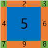

English | [简体中文](Global.md)

> Last synced: 2026-09-29

# Global (Global Styles)

The Global global style provides a common style list, avoiding redundant code and the time developers spend on UI settings caused by the same descriptions appearing in multiple different XML files.

After calling the GlobalManager::Startup method, the [global.xml](../bin/resources/themes/default/global.xml) will be searched for under the configured skin resource path as the global style resource. In the existing samples example code, some preset global styles are included, such as fonts, colors, and some common styles.

## 1. Default Font Name (DefaultFontFamilyNames)
```xml
<!-- Default font name, in list form, matched in order until the first valid font is found as the default font name; multiple font names are separated by commas -->
<DefaultFontFamilyNames value="Microsoft YaHei,SimSun"/>
```
DefaultFontFamilyNames has only one value attribute, used to set the default font list; different fonts are separated by commas (half-width characters).    
The above setting means that the default font name is determined in the order of Microsoft YaHei and SimSun. If the Microsoft YaHei font exists, it is used as the default font; otherwise, SimSun is used as the default font.

## 2. Font

If you want to add a font, add the following code in [global.xml](../bin/resources/themes/default/global.xml), and all font lists will be loaded into the cache after the program starts, distinguished by ID.

```xml
<!-- name represents the font name, size represents the font size, bold represents whether it is bold, underline represents whether it includes an underline -->
<Font id="system_12" name="system" size="12" bold="true" underline="true"/>
```

The id attribute of the Font tag defines a font ID, which defines a font attribute: font name, font size, bold, italic, strikeout, underline. When needed, just specify the font ID. For example, if you want a Button to use the font with ID `system_12`, you can write:

```xml
<Button text="Hello Button" font="system_12"/>
```
When displayed on the UI, the duilib GUI library will draw the text of this button with the font attribute identified by the font ID "system_12" (font name: system default font, font size: 12, bold: yes, underline: yes).

### All Available Attributes of Font

| Attribute Name | Default Value | Parameter Type | Purpose |
| :--- | :--- | :--- | :--- |
| id | | string | Font ID |
| name | | string | The name of the font in the system; "system": system default font, "Microsoft YaHei": Microsoft YaHei, "SimSun": SimSun |
| size | 12 | int | Font size, e.g.: 12 corresponds to "Small Five" font size, 14 corresponds to "No. 5" font size, 16 corresponds to "Small Four" font size, 19 corresponds to "No. 4" font size, 20 corresponds to "Small Three" font size, 21 corresponds to "No. 3" font size |
| bold | false | bool | Whether bold |
| underline | false | bool | Whether underline |
| strikeout | false | bool | Whether strikeout |
| italic | false | bool | Whether italic |
| default | false | bool | Whether it is the default font; if no font is specified for a control, this font is used |

For the code related to font attribute parsing, see the `WindowBuilder::ParseFontXmlNode` function.

## 3. Font File (FontFile)
The program can use its own font files, loaded at program startup, without needing to be installed as system fonts.    
Generally, to define a complete font, 4 font files are required: a regular font file, a bold file, an italic file, and a bold-italic file.    
For example: if you want to add a font file with the font name `Roboto Mono`, add the following code in global.xml:
```xml
<!-- Font file (placed in the fonts directory of the resource root directory), loaded at program startup; after loading, it can be used in the same way as using a system font -->
<FontFile file="RobotoMono-Regular.ttf" desc="Font name: Roboto Mono, Regular"/>
<FontFile file="RobotoMono-Bold.ttf" desc="Font name: Roboto Mono, Bold"/>
<FontFile file="RobotoMono-Italic.ttf" desc="Font name: Roboto Mono, Italic"/>
<FontFile file="RobotoMono-BoldItalic.ttf" desc="Font name: Roboto Mono, Bold Italic"/>
```
Place these four font files, `RobotoMono-Regular.ttf`, `RobotoMono-Bold.ttf`, `RobotoMono-Italic.ttf`, `RobotoMono-BoldItalic.ttf`, in the fonts directory (bin\resources\fonts) of the resource root directory. After the program starts, these font files will be loaded.    
After the font files are loaded, the `Roboto Mono` font can be used in the same way as fonts such as Microsoft YaHei and SimSun; see the description in `2. Font (Font)` in the document for usage.

### All Available Attributes of FontFile

| Attribute Name | Default Value | Parameter Type | Purpose |
| :--- | :--- | :--- | :--- |
| file |      | string | The file name of the font file; the font file must be placed in the fonts directory of the resource root directory |
| desc |      | string | The description information of the font file; no other use |

After the font file is set, the usage method is exactly the same as for a system font (i.e., the font can be specified via the Font tag).

### Usage Example of FontFile
In the previous section of the document, the FontFile tag was used to define a font named `Roboto Mono`. When using it, first define a font ID:
```xml
<!-- name represents the font name, size represents the font size, bold represents whether it is bold, italic represents whether it is italic -->
<Font id="roboto_mono_12" name="Roboto Mono" size="12" bold="true" italic="true"/>
```
Then use this font ID (`roboto_mono_12`) to define the font attribute of the text in a control.    
Suppose you want to define a button with this font ID; the XML configuration can be written as:
```xml
<Button text="Roboto Mono Button" font="roboto_mono_12"/>
```
Note: This RobotoMono font can only be used to display English letters and does not support Chinese, so do not use this font to display Chinese.    

## 4. Color (ThemeColor)

You can add commonly used colors to `global.xml`, as shown below:

```xml
<!-- name is the name of the color, value is the specific value of the color -->
<ThemeColor name="text_default" value="#FFE5E7EB" type="text" category="text_color" fixed="false" comment_cn="Primary text/light gray white" comment_en="Primary text/light gray white"/>
```

Then when you need to use this color to set the text color of a Label, you can write:

```xml
<Label text="Hello Label" normal_text_color="text_default"/>
```

### All Available Attributes of ThemeColor
| Attribute Name| Parameter Type | Purpose |
| :---  | :---   | :---     |
| name  | string | Color name |
| value | string | Color value |
| type  | string | The type of color divided by function, e.g.: "`common`" represents a common color, "`text`" represents a text color, "`window`" represents a window background color, "`button`" represents a button color, "`menu_bar`" represents a menu bar color, "`list_ctrl`" represents a color used by a list, and there are many other values, divided by the control they belong to |
| category | string | The category of color divided by category, e.g.: "`basic_color`" represents a basic color, "`text_color`" represents a text color, "`border_color`" represents a border color, "`bg_color`" represents a background color |
| fixed | bool | Whether the color supports an accent color; "`true`" means it supports the accent color, and when an accent color theme is used, this color will be replaced by the accent color; "`false`" means it does not support the accent color, and when an accent color is used, this color remains unchanged |
| comment_cn     | string | The Chinese comment of the color |
| comment_en     | string | The English comment of the color |

A valid color value (value) is defined as follows:
1. Format like: "#FFFFFFFF", starting with "#", consisting of 8 hexadecimal characters, an ARGB format color value (from left to right: the 1st and 2nd characters represent A (alpha/transparency), the 3rd and 4th characters represent R (red), the 5th and 6th characters represent G (green), the 7th and 8th characters represent B (blue);
2. Format like: "#FFFFFF", starting with "#", consisting of 6 hexadecimal characters, an RGB format color value (from left to right: the 1st and 2nd characters represent R (red), the 3rd and 4th characters represent G (green), the 5th and 6th characters represent B (blue). This format of color has no alpha channel and is treated as opaque;
3. Directly specify a predefined color alias: e.g., "Blue" means blue, "Aqua" means light green, etc. This color alias is defined in the [duilib/Core/UiColors.cpp](../duilib/Core/UiColors.cpp) file, and the color value is defined in the [duilib/Core/UiColors.h](../duilib/Core/UiColors.h) file. These color aliases can be used directly without being defined in `global.xml`.    
Example: The following XML configurations are all valid:
```xml
<Label text="Hello Label" normal_text_color="Aqua"/>
```

```xml
<Label text="Hello Label" normal_text_color="0xFF00FFFF"/>
```

```xml
<Label text="Hello Label" normal_text_color="0x00FFFF"/>
```
However, if the program supports setting theme colors, you still need to use the color values defined by the ThemeColor tag, so that the color value can change with the theme.

## 5. Image (Including Animated Images)

### All Available Attributes of Image

| Attribute Name | Default Value | Parameter Type | Purpose |
| :--- | :--- | :--- | :--- |
| file | | string | The image resource file name (including path); the image resource is loaded based on this setting, e.g.:<br>(1) `file="render/svg_test.png"`: use a relative path to specify the image resource; the render directory should be in the program's resource directory `resources/themes/default`<br>(2) `file="svg_test.png"`: no path specified; when the file is in the same directory as the XML file, no path needs to be specified <br>(3) `file="public/button/window-minimize.svg"`: a relative directory approach; the public directory is a public resource directory, which contains many subdirectories that store public image resources by category; this directory is in the program's resource directory `resources/themes/default`<br>(4) `file="D:/image/apng_test.png"`: use an absolute path to specify the image resource |
| name | | string | The image resource name (a unique string within the control, used to identify the image resource)<br>After setting, the interface of this image resource can be obtained through the `Image* Control::FindImageByName(const DString& imageName) const` function |
| width | | string | The image width, which can enlarge or shrink the image: the value can be pixels or a percentage, e.g.:<br> width="300": set the image width to 300 pixels<br>width="75%": set the image width to 75% of the original image width <br>If only the width is set and the height is not set, the image height is scaled proportionally according to the width |
| height | | string | The image height, which can enlarge or shrink the image: the value can be pixels or a percentage, e.g.:<br> height="300": set the image height to 300 pixels<br>height="75%": set the image height to 75% of the original image height <br>If only the height is set and the width is not set, the image width is scaled proportionally according to the height | 
| src | | rect | The source region setting of the image, in the format src="left,top,right,bottom": it can be used to include only part of the source image content (for example, through this mechanism, the images of each state of a button can be integrated into one large image, and then the image resources of each state are specified through src)<br>The base of the region specified by src is the rectangle range of the source image (0,0,image width,image height)<br>If the width and height of the image are specified using width and height, the base of src is the rectangle range of the specified size (0,0,width,height)<br>For example: the source image is 100 wide and 100 high, specifying `src="10,5,60,40"` means taking the image content with "10,5" as the origin, width 60 and height 40, as the image resource |
| corner | | rect | The nine-patch drawing attribute of the image, usage example: corner="left,top,right,bottom", image diagram: <br>  <br>When using the nine-patch drawing method to draw the image, the image is divided into nine regions in total:<br>The four corners (regions: 1, 3, 7, 8) are not stretched when drawn <br>The four edges (regions: 2, 4, 6, 9) are stretched vertically/horizontally when drawn<br>The middle (region: 5) is stretched by default when drawn, and you can also set the xtiled="true" and ytiled="true" attributes to choose tiled drawing <br> The parameters specified by the corner attribute set the width or height of the regions (4, 2, 6, 9) <br>The base of the region specified by corner is the rectangle range of the source image (0,0,image width,image height)<br>If the width and height of the image are specified using width and height, the base of corner is the rectangle range of the specified size (0,0,width,height)<br>For example: corner="4,2,6,9" means region 4 has a width of 4 pixels, region 2 has a height of 2 pixels, region 6 has a width of 6 pixels, and region 9 has a height of 9 pixels |
| dest | | rect | Set the target region for drawing the image; this region is a rectangle relative to the top-left corner of the owning control (Control::GetRect())<br>For example (assuming the control's rectangle width and height are both 100):<br>(1) dest="10,20,60,70": within the control's rectangle range, the display region of the image is at the position relative to the control's top-left corner coordinate (10,20), and the image width and height are both 50 pixels<br>(2) dest="10,20": within the control's rectangle range, the display region of the image is at the position relative to the control's top-left corner coordinate (10,20), and the image width and height are the width and height of the image resource (only the vertex coordinates can be set; in this case, the drawn target rectangle size is consistent with the image resource size) |
| dest_scale |true | bool | Only valid when the dest attribute is set; controls whether the dest attribute is scaled according to DPI<br>For example (assuming the current screen DPI scaling ratio is 200%):<br>(1) dest="10,20,60,70" dest_scale="true": the actual region of dest after drawing with DPI scaling is: dest="20,40,120,140" <br>(2) dest="10,20,60,70" dest_scale="false": DPI scaling is disabled for the dest region, and the actual region is still: dest="10,20,60,70" <br> If not set, the default value of dest_scale is true<br>This option generally does not need to be specially specified; keeping the default adapts to various DPI screen settings |
| dpi_scale |true | bool | Whether the image supports screen DPI adaptation: <br> (1) dpi_scale="true": supports DPI adaptation; the display size of the image is scaled proportionally according to the screen DPI scaling ratio <br>(2) dpi_scale="false": does not support DPI adaptation: the display size of the image keeps the original image size and is not adjusted according to DPI <br>If dpi_scale="false" is set, when the screen DPI changes, the display size of the image will not change with the DPI; at this time, the layout effect displayed by the program under different DPIs will be different<br>This option affects not only the display region size after the image is loaded, but also the DPI adaptation function of the width, height, src, and corner attributes of the image<br>If the dpi_scale option is not set, the default value is true; this option generally does not need to be adjusted; keeping the default value allows the UI layout to adapt to various screen DPIs |
| adaptive_dest_rect | false | bool | The image size automatically adapts to the target region (scaling the image proportionally); halign/valign can be used to set the alignment of the image in the target region <br> Usage: adaptive_dest_rect="true" or adaptive_dest_rect="false" |
| margin | | rect | Set the margin of the image in the target region |
| halign | | string | Horizontal alignment; possible values: "left", "center", "right" |
| valign | | string | Vertical alignment; possible values: "top", "center", "bottom" |
| fade | 255 | int | The transparency of the image, value range: 0 - 255 |
| xtiled | false | bool | Horizontal tiled drawing; usage: xtiled="true" or xtiled="false" |
| full_xtiled | false | bool | When horizontal tiled drawing, ensure the entire image is drawn; only valid when xtiled is true |
| ytiled | false | bool | Vertical tiled drawing; usage: ytiled="true" or ytiled="false" |
| full_ytiled | false | bool | When vertical tiled drawing, ensure the entire image is drawn; only valid when ytiled is true |
| tiled_margin | 0 | int | The interval between each tiled image when tiled drawing; sets both tiled_margin_x and tiled_margin_y to the same value |
| tiled_margin_x | 0 | int | The interval between each tiled image when tiled drawing; this value is the horizontal tiling interval, only valid when xtiled is true |
| tiled_margin_y | 0 | int | The interval between each tiled image when tiled drawing; this value is the vertical tiling interval, only valid when ytiled is true |
| tiled_padding |  | UiPadding | The inner padding within the target region when tiled drawing (this inner padding combined with TiledMargin can form a grid); only valid when xtiled is true or yxtiled is true |
| window_shadow_mode | false | bool | When nine-patch drawing, do not draw the middle part (e.g., window shadow, only the border needs to be drawn, not the middle part, to avoid unnecessary drawing actions) |
| icon_size | 32 | int | If it is an ICO file, specify the loaded image size of the ICO file |
| icon_as_animation | false | bool | If it is an ICO file, specify whether to load it as a multi-frame image (displayed as an animated image) |
| icon_frame_delay | 1000 | int | If it is an ICO file, when displayed as a multi-frame image, the time interval for each frame to play, in milliseconds |
| auto_play | true | bool | If it is an animated image, whether to play automatically; usage: auto_play="true" or auto_play="false" |
| async_load | true | bool | Whether the image supports asynchronous loading (i.e., loading image data in a child thread to avoid main UI stalling),<br> usage: async_load="true" or async_load="false" <br>The default value can be modified through GlobalManager::Instance().Image().SetImageAsyncLoad |
| play_count | -1 | int | If it is an animated image, used to set the number of play times; the meaning of the value: <br> -1: play continuously <br> 0: no valid play count, use the default value of the image (if the animated image does not have this function, it will play continuously) <br> >0: the specific number of play times; after reaching the play count, playback stops |
| pag_max_frame_rate | 30 | int | If it is a PAG file, used to specify the frame rate of the animation |
| svg_replace_colors | | string | SVG format color replacement parameter: supports replacing color A with color B, so as to avoid configuring a separate svg file under each color theme; with this function, only one svg is needed. Usage example: `"#B5B5B5|color_gray_light"`, means replacing `"#B5B5B5"` with `"color_gray_light"`, and `"color_gray_light"` is defined in global.xml. If there are multiple groups of colors to be replaced, they are separated by semicolons, e.g.: `"#B5B5B5|color_gray_light;#B2B2B2|color_gray_dark"`. When the target is not a color value, this function performs string replacement. |
| assert | true | bool | When image loading fails, whether to allow an assertion (when compiled in debug mode); usage: assert="true" or assert="false" |

Usage example of the image:
```xml
<!-- Use file name: the image file is in the same directory as the XML file, no need to specify the directory where the file is located -->
<Control bkimage="logo_18x18.png"/>
```

```xml
<!-- Use relative directory + file name: the image file is not in the same directory as the XML file,
     need to specify the relative directory of the directory where the file is located (relative to the directory where the XML file is located) -->
<Control bkimage="public/animation/loading1.json"/>
```

```xml
<!-- Use the attributes of the image file: the normal_image attribute specifies an image and sets the image attributes 
     The values in the image attributes can be enclosed in single quotes "'" (e.g.: width='24') -->
<Class name="btn_wnd_min_11" 
       normal_image="file='public/button/window-minimize.svg' width='24' height='24' valign='center' halign='center'" 
       hovered_color="AliceBlue" 
       pressed_color="Lavender"/>
```

```xml
<!-- The following code demonstrates how to use animated images -->
<HBox width="auto" height="auto">           
    <Control width="auto" height="auto" bkimage="file='gif_test.gif' width='150' play_count='-1'" valign="center" margin="8"/>            
    <Control width="auto" height="auto" bkimage="file='apng_test.png' width='150' play_count='-1'" valign="center" margin="8"/>
    <Control width="auto" height="auto" bkimage="file='webp_test.webp' width='150' play_count='-1'" valign="center" margin="8"/>
</HBox>
```

```xml
<!-- The following code demonstrates how to use Event to control animated images (render example program) -->
<Control width="80" height="80" bkimage="file='fan.gif' width='80' height='80' play_count='0' valign='center' halign='center'" hovered_color="AliceBlue" pressed_color="Lavender">
    <Event type="mouse_enter" receiver="" apply_attribute="start_image_animation={}" />
    <Event type="mouse_leave" receiver="" apply_attribute="stop_image_animation={}" />
</Control>
```

## 6. Common Style (Class)

Common styles allow us to preset some frequently used style collections, such as a caption bar with a height of 34, auto-stretched width, and using caption.png as the background.
Or a common style button with a width of 80 and a height of 30, etc. We can all solve them through common styles. The following example demonstrates a common style button:

```xml
<!-- name is the name of the common style, and the others are the attributes in this common style -->
<Class name="btn_global_blue_80x30" font="system_bold_14" normal_text_color="white" 
       normal_image="file='public/button/btn_global_blue_80x30_normal.png'" 
       hovered_image="file='public/button/btn_global_blue_80x30_hovereded.png'" 
       pressed_image="file='public/button/btn_global_blue_80x30_pushed.png'" 
       disabled_image="file='public/button/btn_global_blue_80x30_normal.png' fade='80'"/>
```

The above code defines a button common style named `btn_global_blue_80x30`, using the font ID system_bold_14, the font color in the normal state is `white`,
and sets different background images for the normal state, focus state, and pressed state respectively, and finally enables the animation effect. When we need to apply this common style to a button, we can write:

```xml
<Button class="btn_global_blue_80x30" text="blue" tooltip_text="ui::Buttons"/>
```

It should be noted that **the `class` attribute must be at the very front of all attributes**. When you need to override an attribute specified in a common style, you only need to redefine this attribute after the `class` attribute. For example, if I want my button not to use the font color of the common style, I can write:

```xml
<Button class="btn_global_blue_80x30" font="system_bold_12" text="ui::Buttons"/>
```

When defining a common style, if the attribute value is enclosed in double quotes, you cannot use double quotes inside it again (if you really need to, you can use the XML escape character for double quotes). In this case, you can use single quotes or curly braces to improve readability. For example, the following defines a common style for a combo box, using single quotes (padding='1,1,1,1') and curly braces (padding={1,0,0,0}).
```xml
<!-- Combo box -->
<Class name="combo" bkcolor="white" padding="1,1,1,1" border_size="1" border_color="light_gray" hovered_border_color="blue" 
                    combo_tree_view_class="padding='0,0,0,0' border_size='0,0,0,0' bkcolor='white' border_color='gray' indent='20' class='tree_view'"
                    combo_tree_node_class="tree_node" 
                    combo_icon_class="bkimage='public/caption/logo_18x18.png' width='auto' height='auto' valign='center' margin='2,0,2,0'" 
                    combo_edit_class="bkcolor='white' text_align='vcenter' text_padding='2,0,2,0' single_line='true' word_wrap='false' auto_hscroll='true'"
                    combo_button_class="height={stretch} width={auto} margin={1,0,0,0} padding={1,0,0,0} border_size={1,0,0,0} hovered_border_color={blue} pressed_border_color={blue} valign={center} hovered_color={#FFE5F3FF} pressed_color={#FFCCE8FF} normal_image={file='../public/combo/arrow_normal.svg' valign='center'} hovered_image={file='../public/combo/arrow_hovered.svg' valign='center'}"/>
```

### All Available Attributes of Class

| Attribute Name | Default Value | Parameter Type | Purpose |
| :--- | :--- | :--- | :--- |
| name | | string | Common style name |
| Any custom name | | string | The value of the common style, which must be XML-escaped or use single quotes ('') or curly braces ({}) instead of double quotes |

## 7. Referencing Other Global Resource Files (Include)

When there are many global resources, you can split some of them (variables `Var`, fonts `Font`, font files `FontFile`, colors `ThemeColor`/`TextColor`, common styles `Class`, aliases `Alias`, etc.) into other XML files in the same directory, and reference them via the `Include` node. On program startup, these files' global resources are registered as well, producing the same effect as writing them directly in `global.xml`.

The root node of the referenced file must be `Global`. For example, create a `my_vars.xml` in the same directory as `global.xml`:

```xml
<?xml version="1.0" encoding="UTF-8"?>
<Global>
    <!-- Custom variables -->
    <Var name="SIZE_MY_BTN" value="120x36"/>
    <Var name="PATH_MY_ICON" value="public/my_icon"/>

    <!-- Custom color -->
    <ThemeColor name="my_brand_color" value="#FF3B82F6"/>

    <!-- Custom common style -->
    <Class name="btn_my_style" font="system_regular_14" normal_text_color="white" .../>
</Global>
```

Then reference it in `global.xml` via `Include`:

```xml
<?xml version="1.0" encoding="UTF-8"?>
<Global>
    <Theme name="Default" type="Base" style="Combined" version="2.0"/>
    ...
    <!-- Reference other global resource files in the same directory -->
    <Include src="my_vars.xml"/>
</Global>
```

Attributes:

| Attribute Name | Default | Type | Purpose |
| :--- | :--- | :--- | :--- |
| src (or source) | | string | The file name of the referenced global resource XML, searched first in the same directory as `global.xml` |

Notes:

- The root node of the referenced file must be `Global`, and its global resource tags are written exactly the same as in `global.xml`.
- Referencing is **recursive**: a referenced file may also reference other files in the same directory via `Include`.
- Resources with the same name (e.g. `Var`, `Class`, `ThemeColor` with identical names) follow the rule of **later-loaded overwriting earlier-loaded**, consistent with the ordering semantics of writing them directly in `global.xml`.

## 8. Interfaces Related to Global Resource Management

| Class Name | Associated Header File | Purpose |
| :--- | :--- | :--- |
| GlobalManager | [duilib/Core/GlobalManager.h](../duilib/Core/GlobalManager.h) | A global attribute management utility class, used to manage some global attributes, including global styles (global.xml) and language settings, etc. |
| IRenderFactory | [duilib/Render/IRender.h](../duilib/Render/IRender.h) | A management class for the render interface; manages the render interface, used to create render implementation objects such as Font, Pen, Brush, Path, Matrix, Bitmap, and Render |
| FontManager | [duilib/Core/FontManager.h](../duilib/Core/FontManager.h) | Font management class |
| ColorManager | [duilib/Core/ColorManager.h](../duilib/Core/ColorManager.h) | Color management class |
| IconManager | [duilib/Core/IconManager.h](../duilib/Core/IconManager.h) | HICON handle manager |
| ZipManager | [duilib/Core/ZipManager.h](../duilib/Core/ZipManager.h) | ZIP archive manager |
| DpiManager | [duilib/Core/DpiManager.h](../duilib/Core/DpiManager.h) | DPI manager, used to support DPI adaptation and other functions |
| TimerManager | [duilib/Core/TimerManager.h](../duilib/Core/TimerManager.h) | Timer manager |
| LangManager | [duilib/Core/LangManager.h](../duilib/Core/LangManager.h) | Multi-language support manager |
| ImageManager | [duilib/Core/ImageManager.h](../duilib/Core/ImageManager.h) | Image management class |
| ImageDecoderFactory | [duilib/Image/ImageDecoderFactory.h](../duilib/Image/ImageDecoderFactory.h) | Image decoder management class, supports extending image formats |
| ThreadManager | [duilib/Core/ThreadManager.h](../duilib/Core/ThreadManager.h) | Thread manager, used to support inter-thread communication |
| CursorManager | [duilib/Core/CursorManager.h](../duilib/Core/CursorManager.h) | Cursor management class |
| WindowManager | [duilib/Core/WindowManager.h](../duilib/Core/WindowManager.h) | Window management class |
| ThemeManager  | [duilib/Core/ThemeManager.h](../duilib/Core/ThemeManager.h) | Theme management class |
