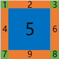

# Global（全局样式）

Global 全局样式提供了通用的样式列表，避免在多个不同的 XML 中出现相同的描述而产生冗余的代码和消耗开发人员在界面设置上的时间。

在调用 GlobalManager::Startup 方法后，会根据设定的皮肤资源路径下查找 [global.xml](../bin/resources/themes/default/global.xml)  作为全局的样式资源。在现有的 samples 示例代码中，
包含了一些预设的全局样式，如字体、颜色和一些通用样式。

## 1. 默认字体名称（DefaultFontFamilyNames）
```xml
<!--默认字体名称，列表形式，依次匹配，直到发现第一个有效字体作为默认字体名称，多个字体名称用逗号分隔-->
<DefaultFontFamilyNames value="微软雅黑,宋体"/>
```
DefaultFontFamilyNames只有一个value属性，用于设置默认字体列表，不同的字体用逗号（半角字符）分隔。    
上述设置代表，按照微软雅黑、宋体的顺序确定默认字体名称，如果存在微软雅黑字体则用微软雅黑字体作为默认字体，否则用宋体作为默认字体。

## 2. 字体（Font）

如果你想添加一个字体，则在 [global.xml](../bin/resources/themes/default/global.xml) 中添加如下代码，程序启动后会加载所有字体列表到缓存中，以 ID 作为区分。

```xml
<!-- name 代表字体名称，size 代表字体大小，bold 代表是否粗体，underline 代表是否包含下划线 -->
<Font id="system_12" name="system" size="12" bold="true" underline="true"/>
```

Font标签的id属性，定义了一个字体ID，该字体ID表示定义了一个字体属性：字体名称、字体大小、粗体、斜体、删除线、下划线。当需要使用时，指定字体ID即可。比如你希望一个 Button 按钮使用 ID 为 `system_12` 的字体，可以这样写：

```xml
<Button text="Hello Button" font="system_12"/>
```
在界面显示时，duilib界面库会以字体ID为"system_12"标识的字体属性（字体名称：系统默认字体，字体大小：12，粗体：是，斜体：是）来绘制这个按钮的文字。

### Font 所有可用属性

| 属性名称 | 默认值 | 参数类型 | 用途 |
| :--- | :--- | :--- | :--- |
| id | | string | 字体ID |
| name | | string | 字体在系统中的名称，"system"：表示系统默认字体，"Microsoft YaHei"：表示微软雅黑，"SimSun"：表示宋体 |
| size | 12 | int | 字体大小，比如：12对应"小五"号字，14对应"五号"字，16对应"小四"号字，19对应"四号"字，20对应"小三"号字，21对应"三号"字 |
| bold | false | bool | 是否粗体 |
| underline | false | bool | 是否下划线 |
| strikeout | false | bool | 是否删除线 |
| italic | false | bool | 是否斜体 |
| default | false | bool | 是否是默认字体，如果未给控件指定字体，则使用该字体 |

字体属性解析相关代码，参见`WindowBuilder::ParseFontXmlNode`函数

## 3. 字体文件（FontFile）
程序可用自带字体文件，在程序启动时加载，不需要安装为系统字体即可使用。    
一般定义一个完整的字体，需要4个字体文件：常规字体文件、粗体文件、斜体文件、粗斜体文件。    
举例：如果想添加一个字体名称为`Roboto Mono`的字体文件，可在 global.xml 中添加如下代码：
```xml
<!-- 字体文件（放在资源根目录的fonts目录中），程序启动时加载，加载后可以按照使用系统字体相同的方式使用 -->
<FontFile file="RobotoMono-Regular.ttf" desc="字体名称：Roboto Mono，常规字体"/>
<FontFile file="RobotoMono-Bold.ttf" desc="字体名称：Roboto Mono，粗体"/>
<FontFile file="RobotoMono-Italic.ttf" desc="字体名称：Roboto Mono，斜体"/>
<FontFile file="RobotoMono-BoldItalic.ttf" desc="字体名称：Roboto Mono，粗斜体"/>
```
将`RobotoMono-Regular.ttf`、`RobotoMono-Bold.ttf`、`RobotoMono-Italic.ttf`、`RobotoMono-BoldItalic.ttf`这四个字体文件，放在资源根目录的fonts目录（bin\resources\fonts）中，程序启动后，就会加载这些字体文件。    
字体文件加载完成后，就可以使用`Roboto Mono`这个字体了，使用方法与微软雅黑、宋体这种字体的方法是相同的，参见文档中的`2. 字体（Font）`的描述的用法。

### FontFile 所有可用属性

| 属性名称 | 默认值 | 参数类型 | 用途 |
| :--- | :--- | :--- | :--- |
| file |      | string | 字体文件的文件名，字体文件需放在资源根目录的fonts目录中|
| desc |      | string | 字体文件的描述信息，无其他用途|

字体文件设置以后，使用方法与系统字体完全相同（即可以通过Font标签指定使用该字体）。

### FontFile 的用法示例
前序文档部分，使用FontFile标签定义了一个字体名称为`Roboto Mono`的字体，使用时首先定义一个字体ID：
```xml
<!-- name 代表字体名称，size 代表字体大小，bold 代表是否粗体，italic 代表是否斜体 -->
<Font id="roboto_mono_12" name="Roboto Mono" size="12" bold="true" italic="true"/>
```
然后使用该字体ID（`roboto_mono_12`）定义控件中文字的字体属性了。    
假设想要用该字体ID定义一个按钮，XML配置可以这样写：
```xml
<Button text="Roboto Mono Button" font="roboto_mono_12"/>
```
注意事项：该RobotoMono字体只能用于显示英文字母，不支持中文，所以不要用这个字体来显示中文。    

## 4. 颜色（TextColor）

你可以添加常用的颜色到 `global.xml` 中，如下所示：

```xml
<!-- name 是颜色的名称，value 是颜色的具体数值 -->
<TextColor name="default_font_color" value="#ff333333"/>
```

这样当你需要使用这个颜色给一个 Label 设置文字颜色时，可以这样写：

```xml
<Label text="Hello Label" normal_text_color="default_font_color"/>
```

### TextColor的所有可用属性

| 属性名称 | 默认值 | 参数类型 | 用途 |
| :--- | :--- | :--- | :--- |
| name | | string | 颜色名称 |
| value | | string | 颜色取值|

一个合法的颜色取值定义如下：
1. 格式如："#FFFFFFFF"形式，以"#"开头，8个16进制字符构成，ARGB格式的颜色值（从左到右：第1、2个字符代表A（透明度），第3、4个字符代表R（红），第5、6个字符代表G（绿），第7、8个字符代表B（红）；
2. 格式如："#FFFFFF"形式，以"#"开头，6个16进制字符构成，RGB格式的颜色值（从左到右：第1、2个字符代表R（红），第3、4个字符代表G（绿），第5、6个字符代表B（红）。这种格式的颜色不含透明通道，按照不透明处理；
3. 直接指定预定义的颜色别名：比如"Blue"表示蓝色，"Aqua"表示浅绿色等，这个颜色别名在[duilib/Core/UiColors.cpp](../duilib/Core/UiColors.cpp)文件中定义，颜色值在[duilib/Core/UiColors.h](../duilib/Core/UiColors.h)文件中定义。这些颜色别名，可用直接使用，不需要在`global.xml`中定义颜色。    
举例：以下XML配置都是正确的：
```xml
<Label text="Hello Label" normal_text_color="Aqua"/>
```

```xml
<Label text="Hello Label" normal_text_color="0xFF00FFFF"/>
```

```xml
<Label text="Hello Label" normal_text_color="0x00FFFF"/>
```

## 5. 图片（包括动画图片）

### 图片的所有可用属性

| 属性名称 | 默认值 | 参数类型 | 用途 |
| :--- | :--- | :--- | :--- |
| file | | string | 图片资源文件名（含路径），根据此设置去加载图片资源，比如：<br>（1）`file="render/svg_test.png"`：使用相对路径指定图片资源，render目录应该在程序的资源目录`resources/themes/default`中<br>（2）`file="svg_test.png"`：不指定路径，该文件在与XML文件相同的目录中时，不需要指定路径 <br>（3）`file="public/button/window-minimize.svg"`：相对目录的方式，public目录是公共资源目录，该目录中有很多子目录，分类保存公共图片资源，此目录在程序的资源目录`resources/themes/default`中<br>（4）`file="D:/image/apng_test.png"`：使用绝对路径指定图片资源|
| name | | string | 图片资源名称（控件内唯一字符串，用于标识图片资源）<br>设置以后，可以通过`Image* Control::FindImageByName(const DString& imageName) const`函数获取到该图片资源的接口|
| width | | string | 图片宽度，可以放大或缩小图像：数值可以是像素或者百分比，比如:<br> width="300"：设置图片宽度为300像素<br>width="75%"：设置图片宽度为图片原宽度的75% <br>如果只设置了宽度，未设置高度，则图片的高度按宽度等比例缩放|
| height | | string | 图片高度，可以放大或缩小图像：数值可以是像素或者百分比，比如:<br> height="300"：设置图片高度为300像素<br>height="75%"：设置图片高度为图片原高度的75% <br>如果只设置了高度，未设置宽度，则图片的宽度按高度等比例缩放| 
| src | | rect | 图片源区域设置，格式为src="left,top,right,bottom"：可以用于仅包含源图片的部分图片内容（比如通过此机制，可以将按钮的各个状态图片整合到一张大图片上，然后通过src指定各个状态的图片资源）<br>src指定的区域，其基准是源图片的矩形范围(0,0,图片宽度,图片高度)<br>如果使用width和height指定了图片的宽度和高度属性，则src的基准是指定尺寸的矩形范围(0,0,width,height)<br>比如：源图片宽100，高100，指定`src="10,5,60,40"`代表取图片以"10,5"为原点，宽度60高度40的图片内容作为图片资源 |
| corner | | rect | 图片的九宫格绘图属性，使用示例: corner="left,top,right,bottom"，图片示意图：<br>  <br>采用九宫格绘制方式绘制图片时，图片共计分为九个区域：<br>四个角（区域：1、3、7、8）的图片绘制时不拉伸 <br>四个边（区域：2、4、6、9）的图片绘制时上下拉伸<br>中间（区域：5）的图片区域默认拉伸绘制，也可以设置xtiled="true"、ytiled="true"属性来选择平铺绘制 <br> corner属性指定的参数，就是设置区域（4、2、6、9）的宽度或者高度 <br>corner指定的区域，其基准是源图片的矩形范围(0,0,图片宽度,图片高度)<br>如果使用width和height指定了图片的宽度和高度属性，则corner的基准是指定尺寸的矩形范围(0,0,width,height)<br>比如：corner="4,2,6,9"，代表区域4的宽度为4像素，区域2的高度为2像素，区域6的宽度为6像素，区域9的高度为9像素 |
| dest | | rect | 设置图片绘制目标区域，该区域是指相对于所属控(Control::GetRect())左上角的矩形区域<br>比如（假定控件的矩形宽度和高度均是100）：<br>（1）dest="10,20,60,70": 是指在控件的矩形范围内，图片的显示区域为相对控件左上角坐标(10,20)的位置，图片宽度和高度均是50像素<br>（2）dest="10,20": 是指在控件的矩形范围内，图片的显示区域为相对控件左上角坐标(10,20)的位置，图片宽度和高度为图片资源的宽度和高度（允许只设置顶点坐标，此时绘制目标矩形区域大小与图片资源大小一致） |
| dest_scale |true | bool | 仅当设置了dest属性时有效，控制对dest属性是否按照DPI缩放<br>比如（假定当前屏幕的DPI缩放比为200%）：<br>（1）dest="10,20,60,70" dest_scale="true"：dest区域在绘制时，按DPI缩放后的实际区域为：dest="20,40,120,140" <br>（2）dest="10,20,60,70" dest_scale="false"：dest区域在绘制时，禁止DPI缩放，实际区域仍然为：dest="10,20,60,70" <br> 如果不设置，dest_scale的默认值为true<br>该选项的值一般不需要特殊指定，保持默认即可适配各种DPI的屏幕设置|
| dpi_scale |true | bool | 该图片是否支持屏幕DPI自适应: <br> （1）dpi_scale="true": 支持DPI自适应，图片的显示尺寸按屏幕DPI缩放比等比例放大 <br>（2）dpi_scale="false": 不支持DPI自适应：图片的显示尺寸保持原图尺寸，不根据DPI调整 <br>如果设置了dpi_scale="false"，当屏幕的DPI变化时，图片的显示尺寸不会随着DPI变化，此时程序在不同DPI下，显示的布局效果会不同<br>该选项除了会影响图片加载后的显示区域大小，同时也会影响图片的width、height、src、corner几个属性值的DPI自适应功能<br>如果不设置dpi_scale选项，默认值为true，该选项一般不需要调整，保持默认值即可做到界面布局能够适应各种屏幕DPI|
| adaptive_dest_rect | false | bool | 图片大小自动适应目标区域（等比例缩放图片），可使用halign/valign设置图片在目标区域中的对齐方式 <br> 用法：adaptive_dest_rect="true" 或者 adaptive_dest_rect="false"|
| margin | | rect | 在目标区域中设置图片的外边距 |
| halign | | string | 横向对齐方式，可取值："left"、"center"、"right" |
| valign | | string | 纵向对齐方式，可取值："top"、"center"、"bottom" |
| fade | 255 | int | 图片的透明度，取值范围：0 - 255 |
| xtiled | false | bool | 横向平铺绘制，用法：xtiled="true" 或者 xtiled="false"  |
| full_xtiled | false | bool | 横向平铺绘制时，保证整张图片绘制, 仅当xtiled为true时有效 |
| ytiled | false| bool | 纵向平铺绘制，用法：ytiled="true" 或者 ytiled="false" |
| full_ytiled | false | bool | 纵向平铺绘制时，保证整张图片绘制, 仅当ytiled为true时有效 |
| tiled_margin | 0 | int | 平铺绘制时，各平铺图片之间的间隔，同时设置tiled_margin_x和tiled_margin_y为相同的值 |
| tiled_margin_x | 0 | int | 平铺绘制时，各平铺图片之间的间隔，此值为横向平铺的间隔，仅当xtiled为true时有效 |
| tiled_margin_y | 0 | int | 平铺绘制时，各平铺图片之间的间隔，此值为纵向平铺的间隔，仅当ytiled为true时有效 |
| tiled_padding |  | UiPadding | 平铺绘制时，在目标区域内的内边距（此内边距结合TiledMargin可用形成网格）， 仅当xtiled为true 或yxtiled为true时有效|
| window_shadow_mode | false | bool | 九宫格绘制时，不绘制中间部分（比如窗口阴影，只需要绘制边框，不需要绘制中间部分，以避免不必要的绘制动作） |
| icon_size | 32 | int | 如果是ICO文件，指定加载ICO文件的图片大小 |
| icon_as_animation | false | bool | 如果是ICO文件，指定是否按多帧图片加载（按动画图片显示） |
| icon_frame_delay | 1000 | int | 如果是ICO文件，当按多帧图片显示时，每帧播放的时间间隔，毫秒 |
| auto_play | true | bool | 如果是动画图片，是否自动播放，用法：auto_play="true" 或者 auto_play="false" |
| async_load | true | bool | 该图片是否支持异步加载（即放在子线程中加载图片数据，避免主界面卡顿），<br> 用法：async_load="true" 或者 async_load="false"  <br>可通过GlobalManager::Instance().Image().SetImageAsyncLoad函数修改此默认值 |
| play_count | -1 | int | 如果是动画图片，用于设置播放次数，取值代表的含义: <br> -1: 表示一直播放 <br> 0 : 表示无有效的播放次数，使用图片的默认值(如果动画图片无此功能，则会一直播放) <br> >0: 具体的播放次数，达到播放次数后，停止播放 |
| pag_max_frame_rate | 30 | int | 如果是PAG文件，用于指定动画的帧率 |
| assert | true | bool | 图片加载失败时，是否允许断言（编译为debug模式时），用法：assert="true" 或者 assert="false"|

图片的使用示例：
```xml
<!-- 使用文件名：图片文件与XML文件在相同目录，不需要指定文件所在目录 -->
<Control bkimage="logo_18x18.png"/>
```

```xml
<!-- 使用相对目录+文件名：图片文件与XML文件不在相同目录，
     需要指定文件所在目录的相对目录（相对与XML文件所在目录） -->
<Control bkimage="public/animation/loading1.json"/>
```

```xml
<!-- 使用图片文件的属性：normal_image属性指定了一个图片，并且设置了图片属性 
     图片属性中的值，可用使用单引号"'"括起来（比如：width='24'）-->
<Class name="btn_wnd_min_11" 
       normal_image="file='public/button/window-minimize.svg' width='24' height='24' valign='center' halign='center'" 
       hot_color="AliceBlue" 
       pushed_color="Lavender"/>
```

```xml
<!-- 以下代码，演示如何使用动画图片 -->
<HBox width="auto" height="auto">           
    <Control width="auto" height="auto" bkimage="file='gif_test.gif' width='150' playcount='-1'" valign="center" margin="8"/>            
    <Control width="auto" height="auto" bkimage="file='apng_test.png' width='150' playcount='-1'" valign="center" margin="8"/>
    <Control width="auto" height="auto" bkimage="file='webp_test.webp' width='150' playcount='-1'" valign="center" margin="8"/>
</HBox>
```

```xml
<!-- 以下代码，演示如何使用Event控制动画图片(render示例程序) -->
<Control width="80" height="80" bkimage="file='fan.gif' width='80' height='80' playcount='0' valign='center' halign='center'" hot_color="AliceBlue" pushed_color="Lavender">
    <Event type="mouseenter" receiver="" apply_attribute="start_image_animation={}" />
    <Event type="mouseleave" receiver="" apply_attribute="stop_image_animation={}" />
</Control>
```

## 6. 通用样式（Class）

通用样式可以让我们预设一些经常使用到的样式集合，比如一个高度为 34，宽度自动拉伸、使用 caption.png 作为背景的标题栏。
又或者一个宽度为 80，高度为 30 的通用样式按钮等等。我们都可以通过通用样式来解决。以下示例演示了一个通用样式按钮：

```xml
<!-- name 是通用样式的名称，其他的是该通用样式中的属性 -->
<Class name="btn_global_blue_80x30" font="system_bold_14" normal_text_color="white" 
       normal_image="file='public/button/btn_global_blue_80x30_normal.png'" 
       hot_image="file='public/button/btn_global_blue_80x30_hovered.png'" 
       pushed_image="file='public/button/btn_global_blue_80x30_pushed.png'" 
       disabled_image="file='public/button/btn_global_blue_80x30_normal.png' 
       fade='80'"/>
```

以上代码定义了一个按钮通用样式，命名为 `btn_global_blue_80x30`，使用字体ID为system_bold_14，普通样式下字体颜色为 `white`，
并分别设置了普通状态、焦点状态和按下状态不同的背景图片，最后还启用了动画效果。当我们需要给一个按钮应用这个通用样式时，可以这样写：

```xml
<Button class="btn_global_blue_80x30" text="blue" tooltip_text="ui::Buttons"/>
```

要注意的是，**`class` 属性必须在所有属性最前面**，当你需要覆盖一个通用样式中指定过的属性时，只需要在 `class` 属性之后再重新定义这个属性就可以了。比如我希望我的按钮不使用通用样式的字体样色，可以这样写：

```xml
<Button class="btn_global_blue_80x30" font="system_bold_12" text="ui::Buttons"/>
```

在定义通用样式的时候，如果属性值被包含在双引号中的时候，里面就不能再用双引号了（如果非要用，可以用双引号的XML转移字符），这种情况下，可以使用单引号或者花括号来提高可读性。例如，以下是定义了一个下拉框的通用样式，其中使用了单引号（padding='1,1,1,1'）和花括号（padding={1,0,0,0}）。
```xml
<!--下拉框-->
<Class name="combo" bkcolor="white" padding="1,1,1,1" border_size="1" border_color="light_gray" hot_border_color="blue" 
                    combo_tree_view_class="padding='0,0,0,0' border_size='0,0,0,0' bkcolor='white' border_color='gray' indent='20' class='tree_view'"
                    combo_tree_node_class="tree_node" 
                    combo_icon_class="bkimage='public/caption/logo_18x18.png' width='auto' height='auto' valign='center' margin='2,0,2,0'" 
                    combo_edit_class="bkcolor='white' text_align='vcenter' text_padding='2,0,2,0' single_line='true' word_wrap='false' auto_hscroll='true'"
                    combo_button_class="height={stretch} width={auto} margin={1,0,0,0} padding={1,0,0,0} border_size={1,0,0,0} hot_border_color={blue} pushed_border_color={blue} valign={center} hot_color={#FFE5F3FF} pushed_color={#FFCCE8FF} normal_image={file='../public/combo/arrow_normal.svg' valign='center'} hot_image={file='../public/combo/arrow_hot.svg' valign='center'}"/>
```

### Class 所有可用属性

| 属性名称 | 默认值 | 参数类型 | 用途 |
| :--- | :--- | :--- | :--- |
| name | | string | 通用样式名称 |
| 任何自定义名称 | | string | 通用样式的值，必须经过XML转义或者使用单引号('')、花括号({})代替双引号 |

## 7. 全局资源管理相关的接口

| 类名称 | 关联头文件| 用途 |
| :--- | :--- | :--- |
| GlobalManager | [duilib/Core/GlobalManager.h](../duilib/Core/GlobalManager.h) | 全局属性管理工具类，用于管理一些全局属性的工具类，包含全局样式（global.xml）和语言设置等 |
| IRenderFactory | [duilib/Render/IRender.h](../duilib/Render/IRender.h) | 渲染接口的管理类，渲染接口管理，用于创建Font、Pen、Brush、Path、Matrix、Bitmap、Render等渲染实现对象 |
| FontManager | [duilib/Core/FontManager.h](../duilib/Core/FontManager.h) | 字体的管理类 |
| ColorManager | [duilib/Core/ColorManager.h](../duilib/Core/ColorManager.h) | 颜色的管理类 |
| IconManager | [duilib/Core/IconManager.h](../duilib/Core/IconManager.h) | HICON句柄管理器 |
| ZipManager | [duilib/Core/ZipManager.h](../duilib/Core/ZipManager.h) | ZIP压缩包管理器 |
| DpiManager | [duilib/Core/DpiManager.h](../duilib/Core/DpiManager.h) | DPI管理器，用于支持DPI自适应等功能 |
| TimerManager | [duilib/Core/TimerManager.h](../duilib/Core/TimerManager.h) | 定时器管理器 |
| LangManager | [duilib/Core/LangManager.h](../duilib/Core/LangManager.h) | 多语言支持管理器 |
| ImageManager | [duilib/Core/ImageManager.h](../duilib/Core/ImageManager.h) | 图片的管理类 |
| ImageDecoderFactory | [duilib/Image/ImageDecoderFactory.h](../duilib/Image/ImageDecoderFactory.h) | 图片解码器的管理类，支持扩展图片格式 |
| ThreadManager | [duilib/Core/ThreadManager.h](../duilib/Core/ThreadManager.h) | 线程管理器，用以支持线程间通信 |
| CursorManager | [duilib/Core/CursorManager.h](../duilib/Core/CursorManager.h) | 光标管理类 |
| WindowManager | [duilib/Core/WindowManager.h](../duilib/Core/WindowManager.h) | 窗口管理类 |
