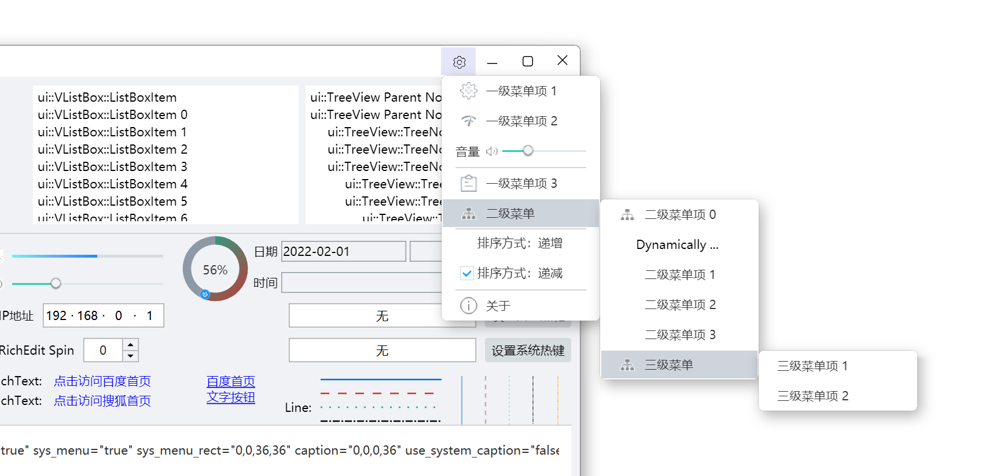

## 菜单
菜单的实现是基于窗口([WindowImplBase](../duilib/Utils/WinImplBase.h))实现的，主要由[CMenuWnd](../duilib/Control/Menu.h)和[CMenuElementUI](../duilib/Control/Menu.h)两个类组成。
1. 菜单的效果预览
这个预览是`examples/controls`示例程序中的菜单。

2. 菜单的实现包含了系统菜单中的基本功能：支持图标、勾选框、多级菜单、菜单项分割条、动态修改菜单项、菜单中插入非菜单控件等。
3. `settings_menu.xml`中的主要内容：
```xml
<?xml version="1.0" encoding="utf-8"?>
<Window>
    <VListBox class="menu">
        <!-- 一级菜单 -->
        <MenuElement class="menu_element" name="first" width="180">
          <Button name="button_01" width="auto" height="auto" bkimage="menu_settings.png" valign="center" mouse="false"/>
          <Label class="menu_text" text="一级菜单项 1" margin="30,0,0,0"/>
        </MenuElement>
    
        <MenuElement class="menu_element" name="second" width="180">
          <Button name="button_02" width="auto" height="auto" bkimage="menu_proxy.png" valign="center" mouse="false"/>
          <Label class="menu_text" text="一级菜单项 2" margin="30,0,0,0"/>
        </MenuElement>
        
        <!-- 在菜单中插入普通控件，实现特定功能 -->
        <HBox class="menu_split_box" height="36">
            <Label class="menu_text" text="音量" textpadding="0,0,6,0"/>
            <Control width="auto" height="auto" bkimage="menu_speaker.png" valign="center"/>
            <Slider class="slider_green" value="70" tooltiptext="ui::Slider"/>        
        </HBox>
        
        <!-- 菜单项之间的分割线 -->
        <Box class="menu_split_box">
            <Control class="menu_split_line" />
        </Box>
        
        <MenuElement class="menu_element" name="third" width="180">
            <Button name="button_03" width="auto" height="auto" bkimage="menu_logs.png" valign="center" mouse="false"/>
            <Label class="menu_text" text="一级菜单项 3" margin="30,0,0,0"/>
        </MenuElement>
        
        <MenuElement class="menu_element" name="fourth" width="180">
            <Button name="button_04" width="auto" height="auto" bkimage="menu_tree.png" valign="center" mouse="false"/>
            <Label class="menu_text" text="二级菜单" margin="30,0,0,0"/>
            <!-- 二级菜单：第一种支持的形式（保持旧版本的兼容性） -->
            <MenuElement class="menu_element" name="sub_menu0" width="180">
                <Button name="button_44" width="auto" height="auto" bkimage="menu_tree.png" valign="center" mouse="false"/>
                <Label class="menu_text" text="二级菜单项 0" margin="30,0,0,0"/>
            </MenuElement>
            <!-- 二级菜单：第二种支持的形式（新增格式，方便在子菜单中添加通用控件） -->
            <SubMenu>
                <MenuElement class="menu_element" name="sub_menu1" width="180">
                    <Label class="menu_text" text="二级菜单项 1" margin="30,0,0,0"/>
                </MenuElement>
                <MenuElement class="menu_element" name="sub_menu2" width="180">
                    <Label class="menu_text" text="二级菜单项 2" margin="30,0,0,0"/>
                </MenuElement>
                <MenuElement class="menu_element" name="sub_menu3" width="180">
                    <Label class="menu_text" text="二级菜单项 3" margin="30,0,0,0"/>
                </MenuElement>
                <MenuElement class="menu_element" name="sub_menu4" width="180">
                    <Button name="button_05" width="auto" height="auto" bkimage="menu_tree.png" valign="center" mouse="false"/>
                    <Label class="menu_text" text="三级菜单" margin="30,0,0,0"/>
                    <!-- 三级菜单 -->
                    <MenuElement class="menu_element" name="sub_sub_menu1" width="180">
                        <Label class="menu_text" text="三级菜单项 1"/>
                    </MenuElement>
                    <MenuElement class="menu_element" name="sub_sub_menu2" width="180">
                        <Label class="menu_text" text="三级菜单项 2"/>
                    </MenuElement>
                </MenuElement>
            </SubMenu>
        </MenuElement>
        
        <!-- 菜单项之间的分割线 -->
        <Box class="menu_split_box">
            <Control class="menu_split_line" />
        </Box>
        
        <!-- 带勾选项的菜单项 -->
        <MenuElement class="menu_element" name="menu_check_01" width="180">
            <CheckBox class="menu_checkbox" name="menu_checkbox_01" text="排序方式：递增" margin="0,5,0,10" selected="true" tooltiptext="ui::Checkbox"/>
        </MenuElement>
        <MenuElement class="menu_element" name="menu_check_02" width="180">
            <CheckBox class="menu_checkbox" name="menu_checkbox_02" text="排序方式：递减" margin="0,5,0,10" selected="false" tooltiptext="ui::Checkbox"/>
        </MenuElement>
        
        <!-- 菜单项之间的分割线 -->
        <Box class="menu_split_box">
            <Control class="menu_split_line" />
        </Box>
    
        <MenuElement class="menu_element" name="about" width="180">
            <Button name="button_06" width="auto" height="auto" bkimage="menu_about.png" valign="center" mouse="false"/>
            <Label class="menu_text" text="关于" margin="30,0,0,0"/>
        </MenuElement>
  </VListBox>
</Window>
```

4. `submenu.xml`中的主要内容：
```xml
<?xml version="1.0" encoding="utf-8"?>
<Window>
  <VListBox class="menu" name="submenu">
   
  </VListBox>
</Window>
```
`submenu.xml`是子菜单的配置文件，可以通过`CMenuWnd::SetSubMenuXml`接口修改：
```cpp
/** 设置多级子菜单的XML模板文件及属性
@param [in] submenuXml 子菜单的XML模板文件名，如果没设置，内部默认为 "submenu.xml"
@param [in] submenuNodeName 子菜单XML文件中，子菜单项插入位置的节点名称，如果没设置，内部默认为 "submenu"
*/
void SetSubMenuXml(const std::wstring& submenuXml, const std::wstring& submenuNodeName);
```
5. `examples/controls`示例程序中显示菜单的代码片段    
显示菜单，并且在二级菜单中，添加子菜单项：
```cpp
void ControlForm::ShowPopupMenu(const ui::UiPoint& point)
{
    ui::CMenuWnd* menu = new ui::CMenuWnd(GetHWND());//需要设置父窗口，否在菜单弹出的时候，程序状态栏编程非激活状态
    std::wstring xml(L"settings_menu.xml");
    menu->ShowMenu(xml, point);

    //在二级菜单中，添加子菜单项
    ui::CMenuElementUI* menu_fourth = static_cast<ui::CMenuElementUI*>(menu->FindControl(L"fourth"));
	if (menu_fourth != nullptr) {
		ui::CMenuElementUI* menu_item = new ui::CMenuElementUI;
		menu_item->SetText(L"Dynamically created");
		menu_item->SetClass(L"menu_element");
		menu_item->SetFixedWidth(ui::UiFixedInt(180), true, true);
		menu_item->SetFontId(L"system_14");
		menu_item->SetTextPadding({ 20, 0, 20, 0 });
		menu_fourth->AddSubMenuItemAt(menu_item, 1);//添加后，资源由菜单统一管理
	}
```

添加菜单项的关联响应函数：
```cpp
    /* About menu */
    ui::CMenuElementUI* menu_about = static_cast<ui::CMenuElementUI*>(menu->FindControl(L"about"));
    if (menu_about != nullptr) {
    	menu_about->AttachClick([this](const ui::EventArgs& args) {
    		AboutForm* about_form = new AboutForm();
    		about_form->CreateWnd(GetHWND(), AboutForm::kClassName, WS_OVERLAPPEDWINDOW & ~WS_MAXIMIZEBOX, WS_EX_LAYERED);
    		about_form->CenterWindow();
    		about_form->ShowModalFake(GetHWND());
    		return true;
    		});
}
```
